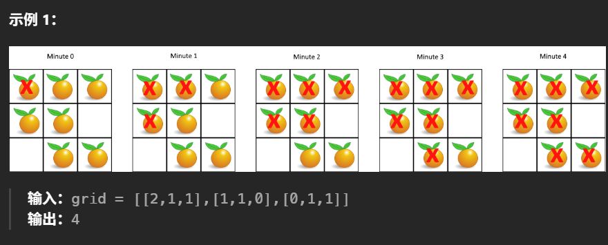
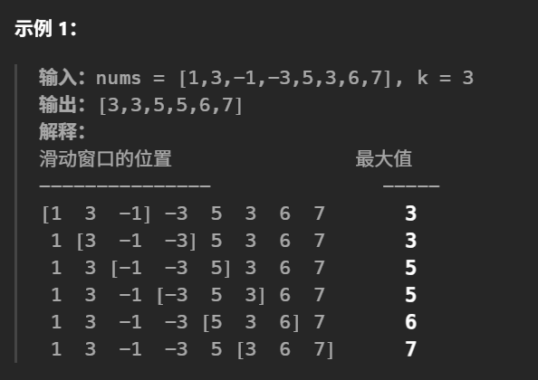
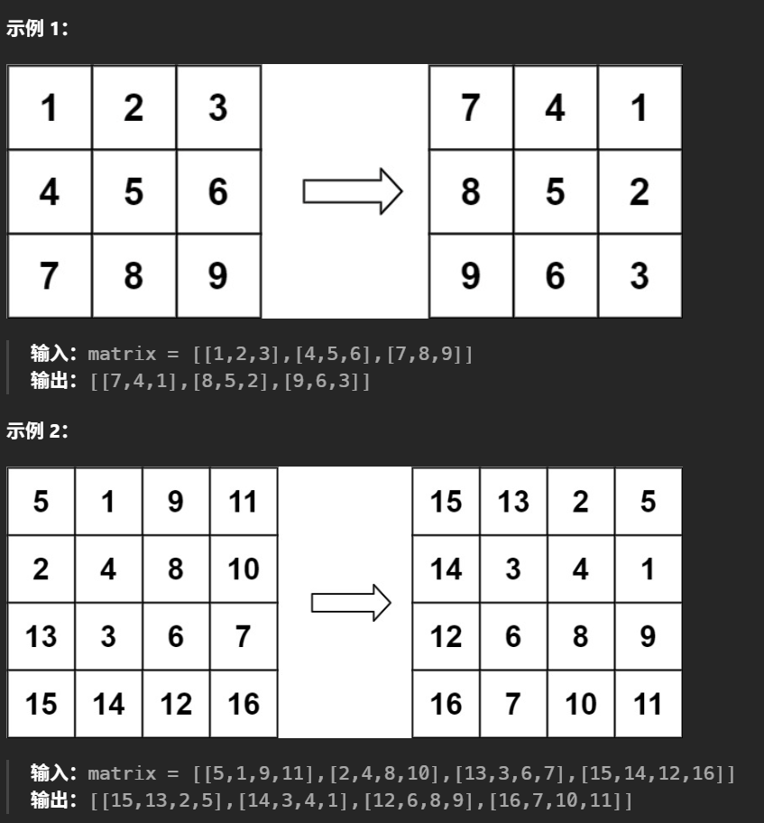
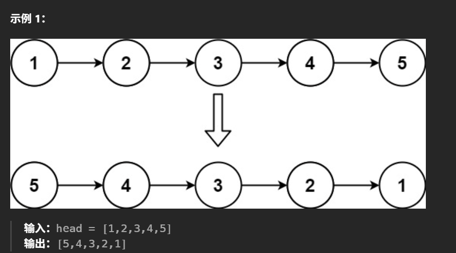
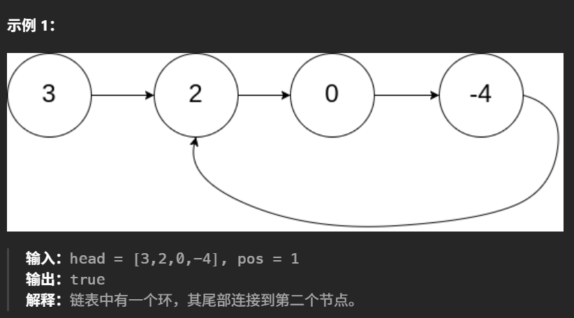
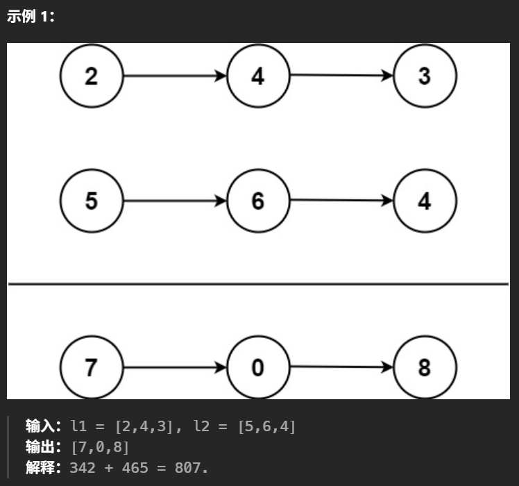
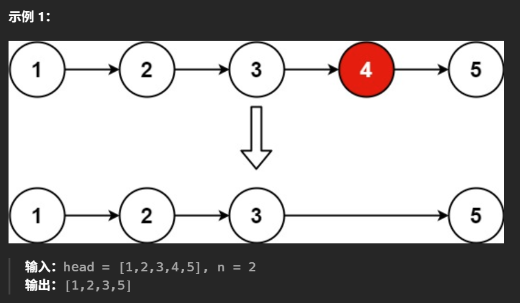
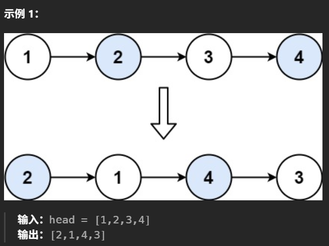
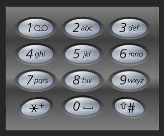

1. **Problem:** Judge a linked list be a circular one or not.

   **Solution:** Use two pointers, one fast and one slow. Move the fast pointer two steps and the slow pointer one step at a time. If they meet, the linked list is circular; if the fast pointer reaches the end, it is not circular.

   **Image example:**
   

   **Code example:**
   ```cpp
   struct ListNode {
       int val;
       ListNode *next;
       ListNode(int x) : val(x), next(NULL) {}
    };

    class Solution {
    public:
        bool hasCycle(ListNode *head) {
            if (head==nullptr or head->next==nullptr){
                return false;
            }
            ListNode *slow = head;
            ListNode *fast = head->next;
            while(fast!=slow){
                if(fast==nullptr or fast->next==nullptr){
                    return false;
                }
                slow=slow->next;
                fast=fast->next->next;
            }
            return true;
        }    
    }
   ```

   **Time complexity:** O(n), where n is the number of nodes in the linked list.

   **Points:** if a linked list is circular, the fast pointer will eventually meet the slow pointer just like a running competition. If it is not circular, the fast pointer will reach the end of the list (null) before meeting the slow pointer.

2. **Problem:** Merge two linked list into one.

   **Solution:** Use a new begin node and then traverse both linked lists, comparing the values of the current nodes. Append the smaller value to the new list and move the pointer of that list forward. Continue until one of the lists is exhausted, then append the remaining nodes from the other list.

   **Code example:**
   ```cpp
    struct ListNode {
        int val;
        ListNode *next;
        ListNode(int x) : val(x), next(NULL) {}
    };

    class Solution {
    public:
        ListNode* mergeTwoLists(ListNode* list1, ListNode* list2) {
            ListNode* dummy = new ListNode();
            ListNode* current = dummy;
            while(list1 != nullptr and list2 != nullptr){
                if(list1->val < list2->val){
                    current->next = list1;
                    list1 = list1->next;
                }
                else{
                    current->next = list2;
                    list2 = list2->next;
                }
                current = current->next;
            }
            if(list1 != nullptr){
                current->next = list1;
            }
            else{
                current->next = list2;
            }

            return dummy->next;
        }
    };
   ```

   **Time complexity:** O(n), where n is the total number of nodes in both linked lists.

   **Points:** Just traverse both linked lists once and compare their values to merge them in sorted order.

3. **Problem:** Use linked lists to store large numbers, try to add them.

   **Solution:** Traverse both linked lists simultaneously, adding corresponding digits along with any carry from the previous addition. Create a new linked list to store the result.

   **Code example:**
   ```cpp
   struct ListNode {
     int val;
     ListNode *next;
     ListNode() : val(0), next(nullptr) {}
     ListNode(int x) : val(x), next(nullptr) {}
     ListNode(int x, ListNode *next) : val(x), next(next) {}
   };

   class Solution {
    public:
        ListNode* addTwoNumbers(ListNode* l1, ListNode* l2) {
            ListNode * dummy = new ListNode();
            ListNode * current = dummy;
            int x = 0;

            while(l1 != nullptr or l2 != nullptr or x!=0){
                if(l1!=nullptr){
                    x += l1->val;
                    l1 = l1->next;
                }
                if(l2!=nullptr){
                    x += l2->val;
                    l2 = l2->next;
                }
                current->next = new ListNode(x%10);
                current = current->next;
                x /= 10;
            }
            return dummy->next;
        }
    };
   ```

   **Time complexity:** O(n), where n is the total number of nodes in both linked lists.

   **Points:** A carry is maintained during the addition process, and the result is stored in a new linked list.

4. **Problem:** Delete the last No.n node from a linked list.

   **Solution:** Use two pointers, one fast and one slow. Move the fast pointer n steps ahead, then move both pointers until the fast pointer reaches the end. The slow pointer will then point to the node to be deleted.

   **Code example:**
   ```cpp
    struct ListNode {
         int val;
         ListNode *next;
         ListNode(int x) : val(x), next(NULL) {}
     };
    
     class Solution {
     public:
          ListNode* removeNthFromEnd(ListNode* head, int n) {
                ListNode * dummy = new ListNode(0);
                dummy->next = head;
                ListNode * fast = dummy;
                ListNode * slow = dummy;
    
                for(int i=0; i<n+1; i++){
                 fast = fast->next;
                }
                while(fast!=nullptr){
                 fast = fast->next;
                 slow = slow->next;
                }
                slow->next = slow->next->next;
    
                return dummy->next;
          }
     };
   ```

   **Time complexity:** O(n), where n is the number of nodes in the linked list.

   **Points:** Let the fast pointer move n+1 steps ahead, then move both pointers until the fast pointer reaches the end. The slow pointer will then point to the node to be deleted.

5. **Problem:** Exchange nodes two by two in a linked list.

   **Solution:** Serveral times of pointers exchange, we can exchange the nodes two by two in a linked list.

   **Code example:**
   ```cpp
    struct ListNode {
         int val;
         ListNode *next;
         ListNode(int x) : val(x), next(NULL) {}
     };
    
     class Solution {
    public:
        ListNode* swapPairs(ListNode* head) {
            if (head==nullptr){
                return nullptr;
            }
            if (head->next==nullptr){
                return head;
            }

            ListNode* prev = new ListNode();
            ListNode* temp = prev;
            temp->next = head;

            while(temp->next!=nullptr and temp->next->next!=nullptr){
                ListNode* node1 = temp->next;
                ListNode* node2 = temp->next->next;
                temp->next = node2;
                node1->next = node2->next;
                node2->next = node1;
                temp = node1;
            }

            return prev->next;
        }
    };
   ```

   **Time complexity:** O(n), where n is the number of nodes in the linked list.

   **Points:** Four nodes are involved in the swapping process: the previous node, the first node to be swapped, the second node to be swapped, and the next node after the second node.

6. **Problem:** Deep copy a linked list with random pointers.

   **Solution:** Use a hash map to store the mapping between original nodes and their copies. First, create all the new nodes and store them in the hash map. Then, iterate through the original list again to set the next and random pointers of the new nodes based on the hash map.

   **Image example:**
   

   **Code example:**
   ```cpp
    struct Node {
         int val;
         Node* next;
         Node* random;
         Node(int _val) {
              val = _val;
              next = NULL;
              random = NULL;
         }
    };

    class Solution {
    public:
        Node* copyRandomList(Node* head) {
            unordered_map<Node*, Node*> hmap;

            Node*current = head;
            while(current!=nullptr){
                hmap[current] = new Node(current->val);
                current = current->next;
            }

            current = head;
            while(current!=nullptr){
                hmap[current]->next = hmap[current->next];
                hmap[current]->random = hmap[current->random];
                current = current->next;
            }

            return hmap[head];
        }
    };
   ```

   **Time complexity:** O(n), where n is the number of nodes in the linked list.

   **Points:** The key is to use a hash map to store the mapping between original nodes and their copies, and then set the next and random pointers of the new nodes based on the hash map.

7. **Problem:** Calculate the depth of a binary tree.

   **Solution:** Do a depth-first search (DFS) or breadth-first search (BFS) to traverse the tree and keep track of the maximum depth encountered.

   **Image example:**
   

   **Code example:**
   ```cpp
    struct TreeNode {
         int val;
         TreeNode *left;
         TreeNode *right;
         TreeNode(int x) : val(x), left(NULL), right(NULL) {}
     };

     class Solution {
     public:
         int maxDepth(TreeNode* root) {
             if(root==nullptr){
                 return 0;
             }
             return 1 + max(maxDepth(root->left), maxDepth(root->right));
         }
     };

     class Solution1 {
     public:
         int maxDepth(TreeNode* root) {
             if(root==nullptr){
                 return 0;
             }
             queue<TreeNode*> q;
             q.push(root);
             int depth = 0;
             while(!q.empty()){
                 int size = q.size();
                 while(size!=0){
                     TreeNode* node = q.front();
                     q.pop();
                     if(node->left!=nullptr){
                         q.push(node->left);
                     }
                     if(node->right!=nullptr){
                         q.push(node->right);
                     }
                     size--;
                 }
                 depth++;
             }
             return depth;
         }
     };
   ```

   **Time complexity:** O(n), where n is the number of nodes in the binary tree.

   **Points:** The key is to use a recursive approach to traverse the tree and keep track of the maximum depth encountered.

8. **Problem:** Invert a binary tree.

   **Solution:** Use a recursive approach to traverse the tree. For each node, swap its left and right children, then recursively invert the left and right subtrees.

   **Image example:**
   

   **Code example:**
   ```cpp
    struct TreeNode {
         int val;
         TreeNode *left;
         TreeNode *right;
         TreeNode(int x) : val(x), left(NULL), right(NULL) {}
     };

     class Solution {
     public:
         TreeNode* invertTree(TreeNode* root) {
             if(root==nullptr){
                 return nullptr;
             }
             else{
                TreeNode* left = invertTree(root->left);
                TreeNode* right = invertTree(root->right);
                root->left = right;
                root->right = left;
             }
             return root;
         }
     };
   ```

   ```python
   def invertTree(root):
       if not root:
            return None
        else:
            left=self.invertTree(root.left)
            right=self.invertTree(root.right)
            root.left=right
            root .right=left
        return root
   ```

   **Time complexity:** O(n), where n is the number of nodes in the binary tree.

   **Points:** The key is to use a recursive approach to traverse the tree and swap the left and right children of each node.

9. **Problem:** Judge if a binary tree is a symmetric binary tree.

   **Solution:** Judge left->right and right->left are equal or not and left->left and right->right are equal or not. If they are equal, the binary tree is symmetric; otherwise, it is not.

   **Image example:**
   

   **Code example:**
   ```cpp
    struct TreeNode {
         int val;
         TreeNode *left;
         TreeNode *right;
         TreeNode(int x) : val(x), left(NULL), right(NULL) {}
     };

     class Solution {
     public:
         bool isSymmetric(TreeNode* root) {
             if(root==nullptr){
                 return true;
             }
             return isMirror(root->left, root->right);
         }

         bool isMirror(TreeNode* left, TreeNode* right){
             if(left==nullptr and right==nullptr){
                 return true;
             }
             if(left==nullptr or right==nullptr){
                 return false;
             }
             return (left->val==right->val) and isMirror(left->left, right->right) and isMirror(left->right, right->left);
         }
     };
   ```

   ```python
    def isSymmetric(root):
         if not root:
              return True
         return self.isMirror(root.left, root.right)
    
    def isMirror(left, right):
         if not left and not right:
            return True
        if not left or not right:
            return False
        
        return left.val==right.val and self.isMirror(left.left, right.right) and self.isMirror(left.right, right.left)
   ```

   **Time complexity:** O(n), where n is the number of nodes in the binary tree.

   **Points:** The key is to use a recursive approach to traverse the tree and check if the left and right subtrees are mirrors of each other, and the mirror ones should be left->left and right->right, left->right and right->left.

10. **Problem:** Make a sorted array into a balanced binary search tree.

    **Solution:** Use a recursive approach to build the tree. Select the middle element of the array as the root, and recursively build the left and right subtrees from the elements before and after the middle element.

    **Code example:**
    ```cpp
       struct TreeNode {
             int val;
             TreeNode *left;
             TreeNode *right;
             TreeNode(int x) : val(x), left(NULL), right(NULL) {}
         };

        class Solution {
        public:
            TreeNode* sortedArrayToBST(vector<int>& nums) {
                if(nums.empty()){
                    return nullptr;
                }
                return buildBST(nums, 0, nums.size()-1);
            }

        private:
            TreeNode* buildBST(vector<int>& nums, int start, int end) {
                if(start>end){
                    return nullptr;
                }
                int mid = start + (end - start) / 2;
                TreeNode* root = new TreeNode(nums[mid]);
                root->left = buildBST(nums, start, mid-1);
                root->right = buildBST(nums, mid+1, end);
                return root;
            }
        };
    ```

    **Time complexity:** O(n), where n is the number of elements in the array.

    **Points:** The key is to use a recursive approach to build the tree by selecting the middle element of the array as the root and recursively building the left and right subtrees.

11. **Problem:** Find the kth smallest element in a binary search tree.

    **Solution:** Use an in-order traversal to visit the nodes in ascending order. Keep a count of the visited nodes and return the k th node.

    **Code example:**
    ```cpp
        struct TreeNode {
             int val;
             TreeNode *left;
             TreeNode *right;
             TreeNode(int x) : val(x), left(NULL), right(NULL) {}
         };

         class Solution {
         public:
             int kthSmallest(TreeNode* root, int k) {
                 int count = 0;
                 int result = 0;
                 inorder(root, k, count, result);
                 return result;
             }

         private:
             void inorder(TreeNode* node, int k, int& count, int& result) {
                 if(node==nullptr){
                     return;
                 }
                 inorder(node->left, k, count, result);
                 count++;
                 if(count==k){
                     result = node->val;
                     return;
                 }
                 inorder(node->right, k, count, result);
             }
         };
    ```

    **Time complexity:** O(n), where n is the number of nodes in the binary tree.

    **Points:** The key is to use a recursive approach to traverse the tree and find the kth smallest element by performing an in-order traversal.

12. **Problem:** Make a binary tree into a linked list.

    **Solution:** use preorder traversal to visit the nodes in the tree and link them together in a linked list.

    **Code example:**
    ```cpp
        struct TreeNode {
             int val;
             TreeNode *left;
             TreeNode *right;
             TreeNode(int x) : val(x), left(NULL), right(NULL) {}
         };

         class Solution {
         public:
            void preorder(TreeNode*node, vector<int>& result){
                if(node==nullptr){
                    return;
                }

                result.push_back(node->val);
                preorder(node->left, result);
                preorder(node->right, result);
            }

            void flatten(TreeNode* root) {
                vector<int> result;
                preorder(root, result);
                TreeNode* current = root;
                for(int i=1; i<result.size(); i++){
                    current->left = nullptr;
                    current->right = new TreeNode(result[i]);
                    current = current->right;
                }
            }
         };
    ```

    **Time complexity:** O(n), where n is the number of nodes in the binary tree.

    **Space complexity:** O(n), where n is the number of nodes in the binary tree.

    **Points:** The key is to use a recursive approach to traverse the tree and convert it into a linked list by performing a preorder traversal.

13. **Problem:** Calculate the total number of islands in a 2D grid.

    **Solution:** Use DFS (Depth-First Search) to traverse the grid. When encountering a '1' (land), initiate a DFS to mark all connected '1's as visited, incrementing the island count.

    **Code example:**
    ```cpp
        class Solution {
        public:
            void dfs(int i, int j, vector<vector<char>>& grid) {
                grid[i][j] = '0'; // Mark the cell as visited
                int rows = grid.size();
                int columns = grid[0].size();
                if (i-1 >= 0 && grid[i-1][j] == '1') dfs(i-1, j, grid); // Up
                if (i+1 < rows && grid[i+1][j] == '1') dfs(i+1, j, grid); // Down
                if (j-1 >= 0 && grid[i][j-1] == '1') dfs(i, j-1, grid); // Left
                if (j+1 < columns && grid[i][j+1] == '1') dfs(i, j+1, grid); // Right
            }

            int numIslands(vector<vector<char>>& grid) {
                int rows = grid.size();
                int columns = grid[0].size();
                int count = 0;
                for(int i=0;i<rows;i++){
                    for(int j=0;j<columns;j++){
                        if(grid[i][j]=='1'){
                            count++;
                            dfs(i,j,grid);
                        }
                    }
                }
            }
        };
    ```
    ```python
    class Solution:
        def dfs(self, i, j, grid):
            grid[i][j] = '0'  # Mark the cell as visited
            rows = len(grid)
            columns = len(grid[0])
            if i-1 >= 0 and grid[i-1][j] == '1':
                self.dfs(i-1, j, grid)  # Up
            if i+1 < rows and grid[i+1][j] == '1':
                self.dfs(i+1, j, grid)  # Down
            if j-1 >= 0 and grid[i][j-1] == '1':
                self.dfs(i, j-1, grid)  # Left
            if j+1 < columns and grid[i][j+1] == '1':
                self.dfs(i, j+1, grid)  # Right

        def numIslands(self, grid: List[List[str]]) -> int:
            rows=len(grid)
            columns=len(grid[0])
            count=0
            for i in range(0,rows):
                for j in range(0,columns):
                    if grid[i][j]=='1':
                        count+=1
                        self.dfs(i,j,grid)
            return count
    ```

    **Time complexity:** O(m*n), where m is the number of rows and n is the number of columns in the grid.

    **Points:** The key is to use a recursive approach to traverse the grid and mark all connected '1's as visited.

14. **Problem:** Bad orange.

    **Solution:** BFS to make the bad oranges rot all the good oranges.

    **Image example:**
    

    **Code example:**
    ```cpp
    class Solution {
    public:
        int orangesRotting(vector<vector<int>>& grid) {
            int rows=grid.size();
            int columns=grid[0].size();
            int freecount=0;

            queue<pair<int, int>> q;

            for(int i=0;i<rows;i++){
                for(int j=0;j<columns;j++){
                    if(grid[i][j]==1){
                        freecount++;
                    }
                    else if(grid[i][j]==2){
                        q.push({i,j});
                    }
                }
            }

            int minutes=0;

            while(!q.empty()){
                if(freecount==0){
                    return minutes;
                }

                int size=q.size();
                minutes++;

                for(int i=0;i<size;i++){
                    auto [x,y] = q.front();
                    q.pop();

                    freecount -= rot(grid,x-1,y,q);
                    freecount -= rot(grid,x+1,y,q);
                    freecount -= rot(grid,x,y-1,q);
                    freecount -= rot(grid,x,y+1,q);
                }
            }

            return freecount>0 ? -1 : minutes;
        }

        int rot(vector<vector<int>>&grid,int x,int y,queue<pair<int,int>>&q){
            int rows=grid.size();
            int columns=grid[0].size();

            if(x<0 or x>=rows or y<0 or y>=columns or grid[x][y]!=1){
                return 0;
            }

            grid[x][y]=2;
            q.push({x,y});

            return 1;
        }
    };
    ```

    ```python
    class Solution:
        def orangesRotting(self, grid: List[List[int]]) -> int:
            rows=len(grid)
            columns=len(grid[0])
            freecount=0

            q=deque()

            for i in range(rows):
                for j in range(columns):
                    if grid[i][j]==1:
                        freecount+=1
                    elif grid[i][j]==2:
                        q.append([i,j])
            
            minutes=0
            while q:
                if freecount==0:
                    return minutes
                minutes+=1

                size=len(q)
                for _ in range(size):
                    temp_lst=q.popleft()
                    x=temp_lst[0]
                    y=temp_lst[1]

                    freecount-=self.rot(grid,x-1,y,q)
                    freecount-=self.rot(grid,x+1,y,q)
                    freecount-=self.rot(grid,x,y-1,q)
                    freecount-=self.rot(grid,x,y+1,q)

            return -1 if freecount>0 else minutes

        def rot(self,grid,x,y,q):
            rows=len(grid)
            columns=len(grid[0])

            if x<0 or x>=rows or y<0 or y>=columns or grid[x][y]!=1:
                return 0

            grid[x][y]=2
            q.append([x,y])

            return 1
    ```

    **Time complexity:** O(m*n), where m is the number of rows and n is the number of columns in the grid.

    **Points:** The key is to use a breadth-first search approach to simulate the rotting process, ensuring all adjacent good oranges become bad in each time step.

15. **Problem:** The table of class.

    **Solution:** The ready of each class is its indegree and only the classes with zero indegree can be taken, when a class is taken, its neighbors' indegrees are reduced, the algorithm is like BFS.

    **Image example:**
    

    **Code example:**
    ```cpp
    class Solution {
    public: 
        bool canFinish(int numCourses, vector<vector<int>>& prerequisites) {
            vector<int> indeg(numCourses, 0);
            vector<vector<int>> edge(numCourses, vector<int>());

            for(auto& p: prerequisites){
                indeg[p[0]]++;
                edge[p[1]].push_back(p[0]);
            }

            queue<int> q;
            int count = 0;

            for(int i=0;i<numCourses;i++){
                if(indeg[i]==0){
                    q.push(i);
                    count++;
                }
            }

            while(!q.empty()){
                int course = q.front();
                q.pop();

                for(int neighbor: edge[course]){
                    indeg[neighbor]--;
                    if(indeg[neighbor]==0){
                        q.push(neighbor);
                        count++;
                    }
                }
            }

            return count==numCourses;
        }
    };
    ```

    ```python
    class Solution:
        def canFinish(self, numCourses: int, prerequisites: List[List[int]]) -> bool:
            indeg = [0] * numCourses
            edge = [[] for _ in range(numCourses)]

            count=0
            for p in prerequisites:
                indeg[p[0]]+=1
                edge[p[1]].append(p[0])
            
            q=deque()
            for i in range(numCourses):
                if indeg[i]==0:
                    q.append(i)
                    count+=1
            
            while q:
                course=q.popleft()
                for neighbor in edge[course]:
                    indeg[neighbor]-=1
                    if indeg[neighbor]==0:
                        q.append(neighbor)
                        count+=1
            
            return count==numCourses
    ```

    **Time complexity:** O(numCourses + prerequisites.size()).

    **Points:** The key is to use a topological sort approach to determine if all courses can be completed, ensuring no circular dependencies exist.

16. **Problem:** Binary Search.

    **Solution:** Use binary search to find the first occurrence of the target value or its insertion point in a sorted array.

    **Code example:**
    ```cpp
    class Solution {
    public:
        int searchInsert(vector<int>& nums, int target) {
            int left = 0;
            int right = nums.size() - 1;

            while(left <= right) {
                int mid = left + (right - left) / 2;
                if (nums[mid] >= target) {
                    right = mid - 1;
                } else {
                    left = mid + 1;
                }
            }
            return left;
        }
    };
    ```

    ```python
    class Solution:
        def searchInsert(self, nums: List[int], target: int) -> int:
            left,right=0,len(nums)-1
            while left <= right:
                mid=left+(right-left)//2
                if target <= nums[mid]:
                    right=mid-1
                else:
                    left=mid+1  
            return left
    ```

    **Time complexity:** O(log n), where n is the number of elements in the sorted array.

    **Points:** The key is to use a binary search approach to efficiently find the insertion point or the target value in a sorted array.

17. **Problem:** Search the first and the last location of the target in a sorted array.

    **Solution:** Use binary search to find the first and last occurrences of the target value.

    **Code example:**
    ```cpp
    class Solution {
    public:
        vector<int> searchRange(vector<int>& nums, int target) {
            int left = 0;
            int right = nums.size() - 1;
            int first = -1;
            int last = -1;

            // Find first occurrence
            while(left <= right) {
                int mid = left + (right - left) / 2;
                if (nums[mid] > target) {
                    right = mid - 1;
                } else {
                    left = mid + 1;
                }
                if (nums[mid] == target) {
                    first = mid;
                    right = mid - 1; // Continue searching in the left half
                }
            }

            // Find last occurrence
            left = 0;
            right = nums.size() - 1;
            while(left <= right) {
                int mid = left + (right - left) / 2;
                if (nums[mid] < target) {
                    left = mid + 1;
                } else {
                    right = mid - 1;
                }
                if (nums[mid] == target) {
                    last = mid;
                    left = mid + 1; // Continue searching in the right half
                }
            }

            vector<int> result;
            result.push_back(first);
            result.push_back(last);
            return result;
        }
    };
    ```

    ```python
    class Solution:
        def searchRange(self, nums: List[int], target: int) -> List[int]:
            left,right=0,len(nums)-1
            first=-1
            last=-1

            # Find first occurrence
            while left <= right:
                mid=left+(right-left)//2
                if target==nums[mid]:
                    right=mid-1
                    first=mid
                elif target<nums[mid]:
                    right=mid-1
                else:
                    left=mid+1

            # Find last occurrence
            left,right=0,len(nums)-1
            while left <= right:
                mid=left+(right-left)//2
                if target==nums[mid]:
                    left=mid+1
                    last=mid
                elif target<nums[mid]:
                    right=mid-1
                else:
                    left=mid+1

            ans=[first,last]
            return ans
    ```

    **Time complexity:** O(log n), where n is the number of elements in the array.

    **Points:** The key is to use binary search twice to find the first and last occurrences of the target value.

18. **Problem:** search rotating array.

    **Solution:** First fing the place where the array is rotated, then use binary search.

    **Code example:**
    ```cpp
    class Solution {
    public:
        int search(vector<int>& nums, int target) {
            if(!nums.size()){
                return -1;
            }

            if(nums.size()==1){
                return nums[0]==target ? 0 : -1;
            }
            
            int left = 1;
            int right = nums.size() - 1;
            int temptarget=nums[0];

            // Find the rotation point
            while(left <= right) {
                int mid = left + (right - left) / 2;
                if (nums[mid] <= temptarget) {
                    right = mid - 1;
                } else {
                    left = mid + 1;
                }
            }

            if (target >= temptarget) {
                left = 0;
            } 
            else {
                right = nums.size() - 1;
            }

            // Perform binary search in the appropriate half
            while(left <= right) {
                int mid = left + (right - left) / 2;
                if (nums[mid] == target) {
                    return mid;
                } 
                else if (nums[mid] < target) {
                    left = mid + 1;
                } 
                else {    
                    right = mid - 1;
                }
            }

            return -1;
        }
    };
    ```

    **Time complexity:** O(log n), where n is the number of elements in the array.

    **Points:** The key is to use binary search to efficiently find the target value in a sorted array, first finding the rotation point and then performing a standard binary search in the appropriate half, paying attention to the boundaries and the actions taken at each step.

19. **Problem:** Effective brackets.

    **Solution:** Use a stack to keep track of the opening brackets and ensure that each closing bracket matches the most recent opening bracket.

    **Code example:**
    ```cpp
    class Solution {
    public:
        bool isValid(string s) {
            stack<char> st;
            for(char c : s) {
                if(c == '(' or c == '{' or c == '[') {
                    st.push(c);
                } 
                else {
                    if(st.empty()) {
                        return false;
                    }
                    char top = st.top();
                    st.pop();
                    if(c == ')' and top != '('){
                        return false;
                    }
                    if(c == '}' and top != '{'){
                        return false;
                    }
                    if(c == ']' and top != '['){
                        return false;
                    }
                }
            }
            return st.empty() ? true : false;
        }
    };
    ```

    ```python
    class Solution:
        def isValid(self, s: str) -> bool:
            stack=[]
            for c in s:
                if c in ['(','{','[']:
                    stack.append(c)
                else:
                    if not stack:
                        return False
                    top=stack.pop()
                    if c==')' and top!='(':
                        return False
                    if c=='}' and top!='{':
                        return False
                    if c==']' and top!='[':
                        return False
            return True if not stack else False
    ```

    ```python
    class Solution:
        def isValid(self, s: str) -> bool:
            stack=[]
            mapping={')':'(', '}':'{', ']':'['}
            for c in s:
                if c in mapping:
                    if not stack or stack[-1]!=mapping[c]:
                        return False
                    stack.pop()
                else:
                    stack.append(c)
            
            return True if not stack else False
    ```

    **Time complexity:** O(n), where n is the length of the string.

    **Points:** The key is to use a stack to match opening and closing brackets, ensuring that each closing bracket corresponds to the most recent opening bracket.

20. **Problem:** Decode the string.

    **Solution:** Use a stack to store the position of the elements and the times it will be repeated.

    **Code example:**
    ```cpp
    class Solution {
    public:
        string decodeString(string s) {
            stack<pair<int, int>> st;
            string ans;
            int count = 0;
            for(auto ch:s){
                if(isdigit(ch)){
                    count = count*10 + (ch-'0');
                }
                else if(isalpha(ch)){
                    ans += ch;
                }
                else if(ch=='['){
                    st.push({ans.size(), count});
                    count = 0;
                }
                else if(ch==']'){
                    auto [pos, times] = st.top();
                    st.pop();
                    string temp = ans.substr(pos, ans.size()-pos);
                    for(int i=0;i<times-1;i++){
                        ans += temp;
                    }
                }
            }
            return ans;
        }
    };
    ```

    ```python
    class Solution:
        def decodeString(self, s: str) -> str:
            stack=[]
            ans=""
            count=0
            for ch in s:
                if ch.isdigit():
                    count=count*10+int(ch)
                elif ch.isalpha():
                    ans+=ch
                elif ch=='[':
                    stack.append([count,len(ans)])
                    count=0
                elif ch==']':
                    times,pos=stack[-1][0],stack[-1][1]
                    stack.pop()
                    temp=ans[pos:len(ans)]
                    ans+=temp*(times-1)
            return ans
    ```

    **Time complexity:** O(n), where n is the length of the input string.

    **Points:** The key is to use a stack to store the position and repetition count of each opening bracket, allowing for efficient string reconstruction when closing brackets are encountered.

21. **Problem:** Daily temperatures
    
    **Solution:** Use a stack to keep track of the indices of the temperatures. For each temperature, pop from the stack until the current temperature is less than or equal to the temperature at the index stored in the stack. The difference in indices gives the number of days until a warmer temperature.

    **Code example:**
    ```cpp
    class Solution {
    public:
        vector<int> dailyTemperatures(vector<int>& temperatures) {
            int n = temperatures.size();
            vector<int> result(n, 0);
            stack<int> st; // Store indices of temperatures         

            for(int i=0; i<n; i++) {
                while(!st.empty() and temperatures[i] > temperatures[st.top()]) {
                    int prev = st.top();
                    st.pop();
                    result[prev] = i - prev;
                }
                st.push(i);
            }

            return result;
        }
    };
    ``` 

    ```python
    class Solution:
        def dailyTemperatures(self, temperatures: List[int]) -> List[int]:
            n=len(temperatures)
            result=[0]*n
            stack=[] # Store indices of temperatures

            for i in range(n):
                while stack and temperatures[i]>temperatures[stack[-1]]:
                    prev=stack.pop()
                    result[prev]=i-prev
                stack.append(i)

            return result
    ```

    **Time complexity:** O(n), where n is the number of temperatures.

    **Points:** The key is to use a stack to efficiently track the indices of temperatures, allowing for quick determination of the number of days until a warmer temperature is encountered and if the warm temperature is actually reached, the former day is recorded in ans and removed from the stack.

22. **Problem:** Quick_select Problem.

    **Solution:** Use quick_sort algorithm and judge the right position of the target element k.

    **Code example:**
    ```cpp
    class Solution {
    public:
        int quick_select(vector<int>& nums, int left, int right, int k) {
            if (left == right) {
                return nums[left];
            }

            int i=left, j=right;
            int pivot = nums[left + (right - left) / 2];
            while (i <= j) {
                while (nums[i] < pivot) i++;
                while (nums[j] > pivot) j--;
                if (i <= j) {
                    swap(nums[i], nums[j]);
                    i++;
                    j--;
                }
            }

            if (k <= j) {
                return quick_select(nums, left, j, k);
            }
            if (k >= i) {
                return quick_select(nums, i, right, k);
            }

            return nums[k];
        }

        int findKthLargest(vector<int>& nums, int k) {
            int n = nums.size();
            return quick_select(nums, 0, n - 1, n - k);
        }
    };
    ```

    ```cpp
    class Solution {
    public:
        int findKthLargest(vector<int>& nums, int k) {
            int n=nums.size();
            priority_queue<int, vector<int>, greater<int>> pq;
            for(int i=0;i<n;i++){
                pq.push(nums[i]);
                if(pq.size()>k){
                    pq.pop();
                }
            }
            return pq.top();
        }

        int findKthLargest_method2(vector<int>& nums, int k) {
            int n=nums.size();
            priority_queue<int> pq;
            for(int i=0;i<n;i++){
                pq.push(nums[i]);
                if(pq.size()>n-k+1){
                    pq.pop();
                }
            }
            return pq.top();
        }
    };
    ```

    ```python
    class Solution:
        def findKthLargest(self, nums: List[int], k: int) -> int:
            n=len(nums)
            pq=[]
            for i in range(n):
                heapq.heappush(pq, nums[i])
                if len(pq)>k:
                    heapq.heappop(pq)
            return pq[0]
    ```

    **Time complexity:** O(n) average, O(n^2) worst case.

    **Points:** The key is to use the quick select algorithm to efficiently find the kth largest element without fully sorting the array.

23. **Problem:** Find the most k frequent elements.

    **Solution:** Use a hash map to count the frequency of each element, then use a max-heap to keep track of the k most frequent elements.

    **Code example:**
    ```cpp
    class Solution {
    public:
        vector<int> topKFrequent(vector<int>& nums, int k) {
            unordered_map<int, int> freqMap;
            for(int num : nums) {
                freqMap[num]++;
            }

            priority_queue<pair<int, int>> maxHeap;
            for(auto& entry : freqMap) {
                maxHeap.push({entry.second, entry.first});
            }

            vector<int> result;
            for(int i = 0; i < k; i++) {
                result.push_back(maxHeap.top().second);
                maxHeap.pop();
            }

            return result;
        }
    };
    ```

    ```python
    class Solution:
        def topKFrequent(self, nums: List[int], k: int) -> List[int]:
            mapping=Counter(nums)
            maxHeap=[]
            for num,freq in mapping.items():
                heapq.heappush(maxHeap,(-freq,num))
            
            result=[]
            for _ in range(k):
                result.append(maxHeap[0][1])
                heapq.heappop(maxHeap)
            
            return result
    ```

    **Time complexity:** O(n log n), where n is the number of elements in the array.

    **Points:** The key is to use a hash map to count the frequency of each element and a max-heap to efficiently retrieve the k most frequent elements, for python language, we can use Counter from collections module or use a dictionary to count the frequency of each element, remember to use the negative value of the frequency as the key for the max-heap, before that please import Couter from collections and import heapq.

24. **Problem:** Find the best time to buy stock.

    **Solution:** Use the algorithm of greedy to find the maximum profit.

    **Code example:**
    ```cpp
    class Solution {
    public:
        int maxProfit(vector<int>& prices) {
            if(!prices.size()){
                return 0;
            }

            int minPrice = prices[0];
            int maxProfit = 0;

            for(int price : prices) {
                minPrice = min(minPrice, price);
                maxProfit = max(maxProfit, price - minPrice);
            }

            return maxProfit;
        }
    };
    ```

    ```python
    class Solution:
        def maxProfit(self, prices: List[int]) -> int:
            if not prices:
                return 0

            minPrice = prices[0]
            maxProfit = 0

            for price in prices:
                minPrice = min(minPrice, price)
                maxProfit = max(maxProfit, price - minPrice)

            return maxProfit
    ```

    **Time complexity:** O(n), where n is the number of elements in the array.

    **Points:** The key is to use a greedy approach to track the minimum price seen so far and calculate the maximum profit by comparing the current price with the minimum price.

25. **Problem:** Jump game.

    **Solution:** Use the algorithm of greedy to find the longest position it can reach.

    **Code example:**
    ```cpp
    class Solution {
    public:
        bool canJump(vector<int>& nums) {
            int maxReach = 0;
            
            for(int i = 0; i < nums.size(); i++){
                if(i <= maxReach){
                    maxReach = max(maxReach, i + nums[i]);
                    if (maxReach >= nums.size() - 1) {
                        return true;
                    }
                }
            }
           
            return false;
        }
    };
    ```

    ```python
    class Solution:
        def canJump(self, nums: List[int]) -> bool:
            maxReach=0
            for i in range(len(nums)):
                if i<=maxReach:
                    maxReach=max(maxReach,i+nums[i])
                    if maxReach>=len(nums)-1:
                        return True
            return False
    ```

    **Time complexity:** O(n), where n is the number of elements in the array.

    **Points:** The key is to use a greedy approach to track the maximum position that can be reached, updating it as we iterate through the array, paying attention to whether the current position is reachable.

26. **Problem:** Jump game II.

    **Solution:** Use the algorithm of greedy to find the minimum number of jumps to reach the end of the array.

    **Code example:**
    ```cpp
    class Solution {
    public:
        int jump(vector<int>& nums) {
            int jumps = 0;
            int currentEnd = 0;
            int farthest = 0;

            for(int i = 0; i < nums.size() - 1; i++) {
                farthest = max(farthest, i + nums[i]);
                if(i == currentEnd) {
                    jumps++;
                    currentEnd = farthest;
                }
                if(currentEnd >= nums.size() - 1) {
                    return jumps;
                }
            }

            return jumps;
        }
    };
    ```

    ```python
    class Solution:
        def jump(self, nums: List[int]) -> int:
            jumps=0
            currentEnd=0
            farthest=0

            if len(nums)<=1:
                return 0

            for i in range(len(nums)-1):
                farthest=max(farthest,i+nums[i])
                if i==currentEnd:
                    jumps+=1
                    currentEnd=farthest
                if currentEnd>=len(nums)-1:
                    return jumps
    ```

    **Time complexity:** O(n), where n is the number of elements in the array.

    **Points:** The key is to use a greedy approach to track the farthest position that can be reached with the current number of jumps, and increment the jump count whenever we reach the end of the current jump range.

27. **Problem:** Separate the word into different strings partitions.

    **Solution:** Use the algorithm of greedy to find the max number of partitions and its length.

    **Code example:**
    ```cpp
    class Solution {
    public:
        vector<int> partitionLabels(string s) {
            vector<int> last(26, -1);
            for(int i = 0; i < s.size(); i++) {
                last[s[i] - 'a'] = i;
            }

            vector<int> result;
            int start = 0, end = 0;
            for(int i = 0; i < s.size(); i++) {
                end = max(end, last[s[i] - 'a']);
                if(i == end) {
                    result.push_back(end - start + 1);
                    start = i + 1;
                }
            }

            return result;
        }
    };
    ```

    **Time complexity:** O(n), where n is the length of the string.

    **Points:** The key is ensure that all the preshowed characters are in the same partition and will never appear in the later partitions, so the end is updated accordingly and when the end of a partition is reached which means all characters in that partition have been considered, we add the length of that partition to the result.

28. **Problem:** Climb stairs.

    **Solution:** Use dynamic programming to calculate the number of ways to reach each step.

    **Code example:**
    ```cpp
    class Solution {
    public:
        int climbStairs(int n) {
            if(n == 1) return 1;
            if(n == 2) return 2;

            int prev2 = 1;
            int prev1 = 2;
            int current;

            for(int i = 3; i <= n; i++) {
                current = prev1 + prev2;
                prev2 = prev1;
                prev1 = current;
            }

            return current;
        }
    };
    ```

    **Time complexity:** O(n), where n is the number of steps.

    **Points:** DP[n] = DP[n-1] + DP[n-2], the number of ways to reach step n is the sum of the ways to reach step n-1 and step n-2, as you can reach step n by taking a single step from n-1 or a double step from n-2.

29. **Problem:** Yang Hui's Triangle.

    **Solution:** Use dynamic programming to generate the triangle row by row.

    **Image example:**
    

    **Code example:**
    ```cpp
    class Solution {
    public:
        vector<vector<int>> generate(int numRows) {
            vector<vector<int>> ans(numRows);

            for(int i = 0; i < numRows; i++) {
                ans[i].resize(i + 1);
                ans[i][0] = ans[i][i] = 1; // First and last elements are always 1
                for(int j = 1; j < i; j++) {
                    ans[i][j] = ans[i - 1][j - 1] + ans[i - 1][j]; // Sum of the two elements above
                }
            }

            return ans;
        }
    };
    ```

    **Time complexity:** O(n^2), where n is the number of rows.

    **Points:** The key is to use dynamic programming to build each row of the triangle based on the values of the previous row, ensuring that the first and last elements of each row are set to 1, and the inner elements are calculated as the sum of the two elements directly above them.

30. **Problem:** Rob problem.

    **Solution:** Use dynamic programming to calculate the maximum amount of money that can be robbed without alerting the police.

    **Code example:**
    ```cpp
    class Solution {
    public:
        int rob(vector<int>& nums) {
            if(nums.empty()) return 0;
            if(nums.size() == 1) return nums[0];

            int n = nums.size();
            vector<int> dp(n);
            dp[0] = nums[0];
            dp[1] = max(nums[0], nums[1]);

            for(int i = 2; i < n; i++) {
                dp[i] = max(dp[i - 1], dp[i - 2] + nums[i]);
            }

            return dp[n - 1];
        }
    };
    ```

    **Time complexity:** O(n), where n is the number of houses.

    **Points:** The key is to use dynamic programming to keep track of the maximum amount of money that can be robbed up to each house, ensuring that no two adjacent houses are robbed, dp[i] = max(dp[i-1], dp[i-2] + nums[i]).

31. **Problem:** Longest increasing subsequence.

    **Solution:** Use dynamic programming to find the length of the longest increasing subsequence in an array.

    **Code example:**
    ```cpp
    class Solution {
    public:
        int lengthOfLIS(vector<int>& nums) {
            if(nums.empty()) return 0;

            int n = nums.size();
            vector<int> dp(n, 1); // Each element is an increasing subsequence of length 1

            for(int i = 1; i < n; i++) {
                for(int j = 0; j < i; j++) {
                    if(nums[i] > nums[j]) {
                        dp[i] = max(dp[i], dp[j] + 1);
                    }
                }
            }

            return *max_element(dp.begin(), dp.end());
        }
    };
    ```

    **Time complexity:** O(n^2), where n is the number of elements in the array.

    **Points:** The key is to use dynamic programming to build up the lengths of increasing subsequences ending at each index, and then find the maximum length among them.

32. **Problem:** Perfect square number.

    **Solution:** Use dynamic programming to find the minimum number of perfect square numbers that sum to a given number.

    **Code example:**
    ```cpp
    class Solution {
    public:
        int numSquares(int n) {
            vector<int> dp(n+1, INT_MAX);
            dp[0] = 0;

            for(int i=1;i<=n;i++){
                for(int j=1;j*j<=i;j++){
                    dp[i] = min(dp[i], dp[i-j*j]+1);
                }
            }

            return dp[n];
        }
    };
    ```

    **Time complexity:** O(n * sqrt(n)), where n is the given number.

    **Points:** The key is to use dynamic programming to build up the minimum number of perfect squares needed for each number up to n, by considering all perfect squares less than or equal to the current number and updating the dp array accordingly.

33. **Problem:** Coin change.

    **Solution:** Use dynamic programming to find the minimum number of coins needed to make up a given amount.

    **Code example:**
    ```cpp
    class Solution {
    public:
        int coinChange(vector<int>& coins, int amount) {
            vector<int> dp(amount + 1, INT_MAX);
            dp[0] = 0;

            for(int i = 0; i <= amount; i++) {
                for(int coin : coins) {
                    if(coin<=i){
                        dp[i] = min(dp[i], dp[i - coin] + 1);
                    }
                }
            }

            return dp[amount] > amount ? -1 : dp[amount];
        }
    };
    ```

    **Time complexity:** O(n * m), where n is the amount and m is the number of different coins.

    **Points:** The key is to use dynamic programming to build up the minimum number of coins needed for each amount up to the target amount, by considering all coin denominations and updating the dp array accordingly.

34. **Problem:** Separate the word and judge whether it can be merged according to the dictionary.

    **Solution:** Use dynamic programming to determine if the string can be segmented into a satisfied string and a word in the dictionary.

    **Code example:**
    ```cpp
    class Solution {
    public: 
        bool wordBreak(string s, vector<string>& wordDict) {
            unordered_set<string> dict(wordDict.begin(), wordDict.end());

            int n = s.size();
            vector<bool> dp(n + 1, false);
            dp[0] = true; // Empty string can be segmented

            for(int i = 0; i <= n; i++) {
                for(int j = 0; j < i; j++) {
                    if(dp[j] and dict.find(s.substr(j, i - j)) != dict.end()) {
                        dp[i] = true;
                        break;
                    }
                }
            }

            return dp[n];
        }
    };
    ```

    **Time complexity:** O(n^2), where n is the length of the string.

    **Points:** The key is to use dynamic programming to determine if the string can be segmented into a sequence of words from the dictionary, ensuring that each substring is a valid word in the dictionary.

35. **Problem:** Longest increasing subsequence.

    **Solution:** Use dynamic programming to find the length of the longest increasing subsequence in an array.

    **Code example:**
    ```cpp
    class Solution {
    public:
        int lengthOfLIS(vector<int>& nums) {
            if(nums.empty()) return 0;

            int n = nums.size();
            vector<int> dp(n, 1);

            for(int i = 1; i < n; i++) {
                for(int j = 0; j < i; j++) {
                    if(nums[i] > nums[j]) {
                        dp[i] = max(dp[i], dp[j] + 1);
                    }
                }
            }

            return *max_element(dp.begin(), dp.end());
        }
    };
    ```

    **Time complexity:** O(n^2), where n is the number of elements in the array.

    **Points:** The key is to use dynamic programming to build up the lengths of increasing subsequences ending at each index, and then find the maximum length among them.

36. **Problem:** Max product subarray.

    **Solution:** Use dynamic programming to find the maximum product of a contiguous subarray.

    **Code example:**
    ```cpp
    class Solution {
    public:
        int maxProduct(vector<int>& nums) {
            if(!nums.size()){ 
                return 0;
            }

            int n = nums.size();
            vector<long long> maxProd(n,nums[0]), minProd(n,nums[0]);

            for(int i=1;i<n;i++){
                long long x = nums[i];
                maxProd[i] = max({x, x*maxProd[i-1], x*minProd[i-1]});
                minProd[i] = min({x, x*maxProd[i-1], x*minProd[i-1]});
            }

            return *max_element(maxProd.begin(), maxProd.end());
        }
    };
    ```

    **Time complexity:** O(n), where n is the number of elements in the array.

    **Points:** The key is to use dynamic programming to keep track of both the maximum and minimum products at each index, as a negative number can turn a small product into a large one and vice versa.

37. **Problem:** Partition equal subset sum.

    **Solution:** Use dynamic programming to determine if the array can be partitioned into two subsets with equal sum.

    **Code example:**
    ```cpp
    class Solution {
    public:
        bool canPartition(vector<int>& nums) {
            int n=nums.size();
            if(n < 2){
                return false;
            }

            int sum=accumulate(nums.begin(), nums.end(), 0);
            if(sum % 2 != 0){
                return false;
            }

            int max_num=*max_element(nums.begin(), nums.end());
            int target=sum/2;
            if(max_num > target){
                return false;
            }

            vector<vector<bool>> dp(n, vector<bool>(target + 1, false));

            for(int i=0;i<n;i++){
                dp[i][0]=true;
            }

            dp[0][nums[0]]=true;

            for(int i=1;i<n;i++){
                int num=nums[i];
                for(int j=1;j<=target;j++){
                    if(j >= num){
                        dp[i][j]=dp[i-1][j] or dp[i-1][j-num];
                    }
                    else{
                        dp[i][j]=dp[i-1][j];
                    }
                }
            }

            return dp[n-1][target];
        }
    };
    ```

    **Time complexity:** O(n * target), where n is the number of elements in the array and target is half of the total sum.

    **Points:** The key is to use dynamic programming to determine if a subset of the array can sum up to half of the total sum, effectively checking if the array can be partitioned into two equal subsets.

38. **Problem:** Unique paths.

    **Solution:** Use dynamic programming to calculate the number of unique paths from the top-left corner to the bottom-right corner of a grid.

    **Code example:**
    ```cpp
    class Solution {
    public:
        int uniquePaths(int m, int n) {
            vector<vector<int>> dp(m, vector<int>(n, 1));

            for(int i = 1; i < m; i++) {
                for(int j = 1; j < n; j++) {
                    dp[i][j] = dp[i - 1][j] + dp[i][j - 1];
                }
            }

            return dp[m - 1][n - 1];
        }
    };
    ```

    **Time complexity:** O(m * n), where m is the number of rows and n is the number of columns in the grid.

    **Points:** The key is to use dynamic programming to build up the number of unique paths to each cell in the grid based on the paths to the cells directly above and to the left.

39. **Problem:** Minimum path sum.
    
    **Solution:** Use dynamic programming to calculate the minimum path sum from the top-left corner to the bottom-right corner of a grid.

    **Code example:**
    ```cpp
    class Solution {
    public:
        int minPathSum(vector<vector<int>>& grid) {
            int m = grid.size();
            int n = grid[0].size();

            vector<vector<int>> dp(m, vector<int>(n, 0));
            dp[0][0] = grid[0][0];

            for(int i = 1; i < m; i++) {
                dp[i][0] = dp[i - 1][0] + grid[i][0];
            }
            for(int j = 1; j < n; j++) {
                dp[0][j] = dp[0][j - 1] + grid[0][j];
            }

            for(int i = 1; i < m; i++) {
                for(int j = 1; j < n; j++) {
                    dp[i][j] = min(dp[i - 1][j], dp[i][j - 1]) + grid[i][j];
                }
            }

            return dp[m - 1][n - 1];
        }
    };
    ```

    **Time complexity:** O(m * n), where m is the number of rows and n is the number of columns in the grid.

    **Points:** The key is to use dynamic programming to build up the minimum path sum to each cell in the grid based on the minimum sums to the cells directly above and to the left, the minimum num is determined by the up or left cell.

40. **Problem:** Longest palindromic substring.

    **Solution:** Use dynamic programming to find the longest palindromic substring in a given string.

    **Code example:**
    ```cpp
    class Solution {
    public:
        string longestPalindrome(string s) {
            int n = s.size();
            if(n == 0) return "";

            vector<vector<bool>> dp(n, vector<bool>(n, false));
            int start = 0, maxLen = 1;

            for(int i = 0; i < n; i++) {
                dp[i][i] = true;
            }

            for(int i=n-1; i>=0; i--) {
                for(int j=i+1; j<n; j++) {
                    if(s[i] == s[j] and (j - i <= 2 or dp[i + 1][j - 1])) {
                        dp[i][j] = true;
                        if(j - i + 1 > maxLen) {
                            start = i;
                            maxLen = j - i + 1;
                        }
                    }
                }
            }

            return s.substr(start, maxLen);
        }
    };
    ```

    **Time complexity:** O(n^2), where n is the length of the string.

    **Points:** The key is to use dynamic programming to build up a table that tracks whether substrings are palindromes, updating the longest palindromic substring found as we iterate through the string, ensuring that we check both the characters at the ends and the status of the substring in between.

41. **Problem:** Longest common substring.

    **Solution:** Use dynamic programming to calculate the length of the longest common substring between two strings.

    **Code example:**
    ```cpp
    class Solution {
    public:
        int longestCommonSubstring(string s1, string s2) {
            int m = s1.size();
            int n = s2.size();
            vector<vector<int>> dp(m + 1, vector<int>(n + 1, 0));
            
            for(int i = 1; i <= m; i++) {
                char c1 = s1[i - 1];
                for(int j = 1; j <= n; j++) {
                    char c2 = s2[j - 1];
                    if(c1 == c2) {
                        dp[i][j] = dp[i - 1][j - 1] + 1;
                    }
                    else {
                        dp[i][j] = max(dp[i - 1][j], dp[i][j - 1]);
                    }
                }
            }

            return dp[m][n];
        }
    };
    ```

    **Time complexity:** O(m * n), where m is the number of rows and n is the number of columns in the grid.

    **Points:** The key is to use dynamic programming to build up the length of the longest common substring at each position in the grid, ensuring that we only consider substrings that are common to both strings, dp[i][j] represents the length of the common substring ending at positions i-1 and j-1 in s1 and s2 respectively, if s1[i-1] == s2[j-1] then dp[i][j] = dp[i-1][j-1] + 1, while if they are not equal, we take the maximum of the previous values dp[i-1][j] and dp[i][j-1].

42. **Problem:** Edit distance.

    **Solution:** Use dynamic programming to calculate the minimum number of operations required to convert one string into another.

    **Code example:**
    ```cpp
    class Solution {
    public:
        int minDistance(string word1, string word2) {
            int m = word1.size();
            int n = word2.size();
            vector<vector<int>> dp(m + 1, vector<int>(n + 1, 0));

            if(m*n == 0) {
                return m + n;
            }
            
            for(int i = 1; i <= m; i++) {
                dp[i][0] = i;
            }
            for(int j = 1; j <= n; j++) {
                dp[0][j] = j;
            }

            
            for(int i=1;i<=m;i++){
                for(int j=1;j<=n;j++){
                    if(word1[i-1]==word2[j-1]){
                            dp[i][j]=min(dp[i-1][j-1], min(dp[i-1][j]+1, dp[i][j-1]+1));
                        }
                    else{
                        dp[i][j]=min(dp[i-1][j-1]+1, min(dp[i][j-1]+1,dp[i-1][j]+1));
                    }
                }
            }

            return dp[m][n];
        }
    };
    ```

    **Time complexity:** O(m * n), where m is the length of the first string and n is the length of the second string.

    **Points:** The key is to use dynamic programming to build up the minimum edit distance at each position in the grid, ensuring that we only consider the operations needed to transform one string into another. The value at dp[i][j] represents the minimum number of operations required to convert the first i characters of word1 into the first j characters of word2. If the characters match, we take the value from dp[i-1][j-1]; if they do not match, we take the minimum value from either dp[i-1][j]+1 (deletion), dp[i][j-1]+1 (insertion), or dp[i-1][j-1]+1 (substitution).

43. **Problem:** Next permutation.

    **Solution:** Find the first element from the right that is smaller than its next element, then swap it with the smallest element to its right that is larger than it, and finally reverse the elements to its right.

    **Code example:**
    ```cpp
    class Solution {
    public:
        void nextPermutation(vector<int>& nums) {
            int n = nums.size();

            int i = n - 2;
            while(i >= 0 && nums[i] >= nums[i + 1]) {
                i--;
            }

            if(i >= 0) {
                int j = n - 1;
                while(nums[j] <= nums[i]) {
                    j--;
                }
                swap(nums[i], nums[j]);
            }

            reverse(nums.begin() + i + 1, nums.end());
        }
    };
    ```

    **Time complexity:** O(n), where n is the number of elements in the array.

    **Points:** After putting the smaller one element in place, we reverse the elements to its right to get the next permutation in lexicographical order.

44. **Problem:** Trapping rain water.

    **Solution:** Use two pointers to calculate the trapped water by keeping track of the maximum heights from both ends.

    **Code example:**
    ```cpp
    class Solution {
    public:
        int trap(vector<int>& height) {
            int ans = 0;
            int left = 0, right = height.size() - 1;
            int leftMax = 0, rightMax = 0;

            while(left < right) {
                leftMax = max(leftMax, height[left]);
                rightMax = max(rightMax, height[right]);

                if(leftMax < rightMax) {
                    ans += leftMax - height[left];
                    left++;
                } 
                else {
                    ans += rightMax - height[right];
                    right--;
                }
            }

            return ans;
        }
    };
    ```

    **Time complexity:** O(n), where n is the number of elements in the array.

    **Points:** The key is to use two pointers to traverse the array from both ends, keeping track of the maximum heights encountered so far and calculating the trapped water based on the difference between the current height and the maximum height.

45. **Problem:** Longest substring without repeating characters.

    **Solution:** Use a sliding window approach with a hash map to keep track of the characters and their indices.

    **Code example:**
    ```cpp
    class Solution {
    public:
        int lengthOfLongestSubstring(string s) {
            unordered_set<char> charSet;
            int left = 0, maxLength = 0;
            int n = s.size();

            for(int right = 0; right < n; right++) {
                while(charSet.find(s[right]) != charSet.end()) {
                    charSet.erase(s[left]);
                    left++;
                }
                charSet.insert(s[right]);
                maxLength = max(maxLength, right - left + 1);
            }

            return maxLength;
        }
    };
    ```

    **Time complexity:** O(n), where n is the length of the string.

    **Points:** The key is to use a sliding window approach with a hash set to keep track of the characters in the current substring, expanding the window by moving the right pointer and contracting it by moving the left pointer when a duplicate character is found, if you find that the current character is already in the set, you should move the left pointer to remove it until it's no longer in the set because it must be a substring of the original string.

46. **Problem:** Find all anagrams in a string.

    **Solution:** Use a sliding window approach with a hash map to keep track of the characters and their frequencies.

    **Code example:**
    ```cpp
    class Solution {
    public:
        vector<int> findAnagrams(string s, string p) {
            vector<int> ans;
            vector<int> pCount(26, 0), sCount(26, 0);
            int pLen = p.size(), sLen = s.size();
            if (sLen < pLen) return ans;

            for (char c : p) {
                pCount[c - 'a']++;
            }

            int left = 0;
            for (int right = 0; right < sLen; right++) {
                sCount[s[right] - 'a']++;
                if (right - left + 1 == pLen) {
                    if (sCount == pCount) {
                        ans.push_back(left);
                    }
                    sCount[s[left] - 'a']--;
                    left++;
                }
            }

            return ans;
        }
    };
    ```

    **Time complexity:** O(n), where n is the length of the string s.

    **Points:** The key is to use a sliding window approach with a hash map to keep track of the characters and their frequencies, expanding the window by moving the right pointer and contracting it by moving the left pointer when the window size equals the length of string p.

47. **Problem:** Subarray sum equal to k.

    **Solution:** Use a prefix sum approach with a hash map to store the frequencies of the prefix sums.

    **Code example:**
    ```cpp
    class Solution {    
        int subarraySum(vector<int>& nums, int k) {
            unordered_map<int, int> prefixSumCount;
            prefixSumCount[0] = 1; // Base case: one way to have a sum of 0
            int currentSum = 0;
            int count = 0;

            for (int num : nums) {
                currentSum += num;
                if (prefixSumCount.find(currentSum - k) != prefixSumCount.end()) {
                    count += prefixSumCount[currentSum - k];
                }
                prefixSumCount[currentSum]++;
            }

            return count;
        }
    };
    ```

    **Time complexity:** O(n), where n is the length of the array nums.

    **Points:** The key is to use a prefix sum approach with a hash map to store the frequencies of the prefix sums, and then for each element, check if there exists a previous prefix sum such that the difference between them is equal to k, the method prefix sum is used to efficiently calculate the sum of any subarray, by minus the prefix sum of the previous element we can get the sum of the subarray between the two elements and use a hash map to store the frequencies of the prefix sums so that we can quickly look up the number of subarrays that sum to k.

48. **Problem:** Sliding window maximum.

    **Solution:** Use a max heap to keep track of the maximum element in the current sliding window, and update the heap as the window slides.

    **Image example:**
    

    **Code example:**
    ```cpp
    class Solution {
    public:
        vector<int> maxSlidingWindow(vector<int>& nums, int k) {
            priority_queue<pair<int, int>> maxHeap; // Store pairs of (value, index)
            vector<int> result;

            for(int i=0;i<k;i++){
                maxHeap.push({nums[i], i});
            }

            result.push_back(maxHeap.top().first);

            for(int i=k;i<nums.size();i++){
                maxHeap.push({nums[i], i});
                while(maxHeap.top().second <= i - k){
                    maxHeap.pop();
                }
                result.push_back(maxHeap.top().first);
            }

            return result;
        }
    };
    ```

    **Time complexity:** O(n log k), where n is the length of the array and k is the size of the sliding window.

    **Space complexity:** O(k), where k is the size of the sliding window.

    **Points:** The key is to use a max heap to keep track of the maximum element in the current sliding window, and update the heap as the window slides, the priority queue is used to maintain the elements in the window in a way that allows for efficient retrieval of the maximum element, we compare the value by its true value and decide whether to pop it from the heap based on its index to ensure that we only consider elements that are still within the current window.

49. **Problem:** Minimum window substring.

    **Solution:** Use a sliding window approach with two pointers to find the minimum window that contains all characters of the target string.

    **Code example:**
    ```cpp
    class Solution {
    public:
        unordered_map<char, int> ori, charCount;

        bool check() {
            for (auto it : ori) {
                if (charCount[it.first] < it.second) {
                    return false;
                }
            }
            return true;
        }

        string minWindow(string s, string t) {
            for(char c : t){
                ori[c]++;
            }

            int left = 0, right = 0;
            int len = INT_MAX, start = -1;

            while(right < s.size()){
                char c = s[right];
                if(ori.find(c) != ori.end()){
                    charCount[c]++;
                }

                while(check() and left <= right){
                    if(right - left + 1 < len){
                        len = right - left + 1;
                        start = left;
                    }
                    char d = s[left];
                    if(ori.find(d) != ori.end()){
                        charCount[d]--;
                    }
                    left++;
                }
                right++;
            }

            return start == -1 ? "" : s.substr(start, len);

        }
    };
    ```

    **Time complexity:** O(n), where n is the length of the string.

    **Points:** The key is to use a sliding window approach with two pointers to find the minimum window that contains all characters of the target string, and update the window boundaries as we expand and contract the window to ensure we find the optimal solution, use a hash map to store the frequency of characters in the target string and the current window.

50. **Problem:** Maximum subarray.

    **Solution:** Use dynamic programming.

    **Code example:**
    ```cpp
    class Solution {
    public:
        int maxSubArray(vector<int>& nums) {
            int maxSum = nums[0];
            int currentSum = nums[0];

            for(auto num : nums) {
                currentSum = max(num, currentSum + num);
                maxSum = max(maxSum, currentSum);
            }

            return maxSum;
        }
    };
    ```

    **Time complexity:** O(n), where n is the length of the array.

    **Points:** The key is to use dynamic programming to keep track of the maximum sum of the subarray ending at each position, and update the overall maximum sum as we iterate through the array, dynamic programming is useful for solving optimization problems by breaking them down into smaller subproblems, and when facing different choices at each step, we can use dynamic programming to find the optimal solution.

51. **Problem:** Merge intervals.

    **Solution:** Traverse the intervals and merge overlapping ones by comparing the end of the previous interval with the start of the current interval.

    **Code example:**
    ```cpp
    class Solution {
    public:
        vector<vector<int>> merge(vector<vector<int>>& intervals) {
            if(intervals.empty()){
                return {};
            }

            sort(intervals.begin(), intervals.end());
            vector<vector<int>> merged;
            merged.push_back(intervals[0]);

            for(int i = 1; i < intervals.size(); i++) {
                int left = intervals[i][0], right = intervals[i][1];
                if(merged.back()[1] < left) {
                    merged.push_back(intervals[i]);
                } else {
                    merged.back()[1] = max(merged.back()[1], intervals[i][1]);
                }
            }

            return merged;
        }
    };
    ```

    **Time complexity:** O(n log n), where n is the number of intervals.

    **Points:** The key is to sort the intervals first and then traverse them to merge overlapping ones, and compare the end of the previous interval with the start of the current interval.

52. **Problem:** Rotate array.

    **Solution:** Reverse the entire array, then reverse the first k elements, and finally reverse the remaining elements.

    **Code example:**
    ```cpp
    class Solution {
    public:
        void rotate(vector<int>& nums, int k) {
            k %= nums.size();
            reverse(nums.begin(), nums.end());
            reverse(nums.begin(), nums.begin() + k);
            reverse(nums.begin() + k, nums.end());
        }
    };
    ```

    **Time complexity:** O(n), where n is the number of elements in the array.

    **Points:** The key is to use the three-step reversal technique to rotate the array in place.

53. **Problem:** Product of array except self.

    **Solution:** Create two arrays to store the product of all elements to the left and right of each index, then multiply the corresponding elements.

    **Code example:**
    ```cpp
    class Solution {
    public:
        vector<int> productExceptSelf(vector<int>& nums) {
            int n = nums.size();
            vector<int> left(n, 1);
            vector<int> right(n, 1);
            vector<int> result(n);

            for (int i = 1; i < n; i++) {
                left[i] = left[i - 1] * nums[i - 1];
            } //left[0] = 1, left[1] = nums[0], left[2] = nums[0]*nums[1], left[3] = nums[0]*nums[1]*nums[2]

            for (int i = n - 2; i >= 0; i--) {
                right[i] = right[i + 1] * nums[i + 1];
            } //right[n-1] = 1, right[n-2] = nums[n-1], right[n-3] = nums[n-1]*nums[n-2], right[n-4] = nums[n-1]*nums[n-2]*nums[n-3]

            for (int i = 0; i < n; i++) {
                result[i] = left[i] * right[i];
            }

            return result;
        }
    };
    ```

    **Time complexity:** O(n), where n is the number of elements in the array.

    **Points:** The key is to use two auxiliary arrays to store the product of all elements to the left and right of each index, and then multiply the corresponding elements to get the final result. This approach avoids using division and ensures that we can calculate the product for each index in linear time, left[i] represents the product of all elements to the left of index i, and right[i] represents the product of all elements to the right of index i. By multiplying these two values together, we get the product of all elements except for the one at index i. 

54. **Problem:** Spiral Matrix.

    **Solution:** Use a four-pointer approach to traverse the matrix in a spiral order.

    **Code example:**
    ```cpp
    class Solution {
    public:
        vector<int> spiralOrder(vector<vector<int>>& matrix) {
            int rows=matrix.size(), cols=matrix[0].size();
            vector<int> result;
            int top=0, bottom=rows-1, left=0, right=cols-1;

            while(result.size() < rows * cols) {
                for(int i=left; i<=right && result.size() < rows * cols; i++) {
                    result.push_back(matrix[top][i]);
                }
                top++;
                for(int i=top; i<=bottom && result.size() < rows * cols; i++) {
                    result.push_back(matrix[i][right]);
                }
                right--;
                for(int i=right; i>=left && result.size() < rows * cols; i--) {
                    result.push_back(matrix[bottom][i]);
                }
                bottom--;
                for(int i=bottom; i>=top && result.size() < rows * cols; i--) {
                    result.push_back(matrix[i][left]);
                }
                left++;
            }

            return result;
        }
    };
    ```

    **Time complexity:** O(m * n), where m is the number of rows and n is the number of columns in the matrix.

    **Points:** The key is to use four pointers to keep track of the boundaries of the current layer being traversed, and update these pointers as we complete each layer of the spiral traversal, ensuring that we cover all elements in the matrix without repetition. The four pointers (top, bottom, left, right) define the current boundaries of the spiral traversal, and we adjust them after completing each direction of movement (right, down, left, up) to move inward to the next layer of the spiral.

55. **Problem:** Rotate Image.

    **Solution:** Transpose the matrix and then reverse each row.

    **Image example:**
    

    **Code example:**
    ```cpp
    class Solution {
    public:
        void rotate(vector<vector<int>>& matrix) {
            int n = matrix.size();
            // Transpose the matrix
            for(int i = 0; i < n; i++) {
                for(int j = i + 1; j < n; j++) {
                    swap(matrix[i][j], matrix[j][i]);
                }
            }
            // Reverse each row
            for(int i = 0; i < n; i++) {
                reverse(matrix[i].begin(), matrix[i].end());
            }
        }
    };
    ```

    ```cpp
    class Solution {
    public:
        void rotate(vector<vector<int>>& matrix) {
            int n = matrix.size();

            vector<vector<int>> matrix_new=matrix;
            for(int i=0;i<n;i++){
                for(int j=0;j<n;j++){
                    matrix[j][n-1-i]=matrix_new[i][j];
                }
            }
        }
    };
    ```
    
    **Time complexity:** O(n^2), where n is the number of rows (or columns) in the matrix.

    **Points:** The key is to create a new matrix and fill it with the rotated elements, ensuring that each element is placed in its correct position in the rotated matrix or another method is that transpose and reverse the matrix.

56. **Problem:** Search a 2d matrix II.

    **Solution:** Start from the top-right corner and move either down or left based on the comparison with the target, or use binary search for each row.

    **Code example:**
    ```cpp
    class Solution {
    public:
        bool searchMatrix(vector<vector<int>>& matrix, int target) {
            int m = matrix.size();
            int n = matrix[0].size();
            int i = 0, j = n - 1;

            while(i < m && j >= 0) {
                if(matrix[i][j] == target) {
                    return true;
                } 
                if(matrix[i][j] > target) {
                    j--;
                } else {
                    i++;
                }
            }

            return false;
        }
    };
    ```

    ```cpp
    class Solution {
    public:
        bool searchMatrix(vector<vector<int>>& matrix, int target) {
            int m = matrix.size();
            int n = matrix[0].size();

            for(int i = 0; i < m; i++) {
                if(binary_search(matrix[i].begin(), matrix[i].end(), target)) {
                    return true;
                }
            }

            return false;
        }

        bool binary_instance(vector<vector<int>>& matrix, int target) {
            for(auto& row : matrix) {
                auto it = lower_bound(row.begin(), row.end(), target);
                if(it != row.end() && *it == target) {
                    return true;
                }
            }

            return false;
        }
    };
    ```

    **Time complexity:** O(m + n), where m is the number of rows and n is the number of columns in the matrix.

    **Points:** The key is to start from the top-right corner of the matrix and move either down or left based on the comparison with the target, or use binary search for each row to find the target efficiently. The first method takes advantage of the sorted properties of the matrix, allowing us to eliminate rows or columns based on the current element's value compared to the target. The second method uses binary search on each row, which is efficient for searching in sorted arrays.

57. **Problem:** Intersection of Two Linked Lists.

    **Solution:** Traverse both lists and when one reaches the end, redirect it to the head of the other list. This way, both pointers will meet at the intersection point or both become NULL if there is no intersection.

    **Code example:**
    ```cpp
    class Solution {
    public:
        ListNode *getIntersectionNode(ListNode *headA, ListNode *headB){
            if(!headA or !headB) return nullptr;

            ListNode* pa=headA, *pb=headB;
            while(pa!=pb){
                if(!pa){
                    pa=headB;
                }
                else{
                    pa=pa->next;
                }
                if(!pb){
                    pb=headA;
                }
                else{
                    pb=pb->next;
                }
            }

            return pa;
        }
    };
    ```
    ```python
    class Solution:
        def getIntersectionNode(self, headA: ListNode, headB: ListNode) -> Optional[ListNode]:
            if not headA or not headB:
                return None

            pa, pb = headA, headB
            while pa != pb:
                if not pa:
                    pa = headB
                else:
                    pa = pa.next
                if not pb:
                    pb = headA
                else:
                    pb = pb.next

            return pa
    ```

    **Time complexity:** O(m * n), where m is the number of rows and n is the number of columns in the grid.

    **Points:** The key is to use two pointers to traverse both linked lists, redirecting each pointer to the head of the other list when it reaches the end. This ensures that both pointers will meet at the intersection point or both become NULL if there is no intersection.

58. **Problem:** Reverse Linked List.

    **Solution:** Use an iterative approach to reverse the linked list by changing the next pointers of each node.

    **Image example:**
    

    **Code example:**
    ```cpp
    class Solution {
    public:
        ListNode* reverseList(ListNode* head) {
            ListNode *prev=nullptr;
            ListNode *curr=head;

            while(curr){
                ListNode *next=curr->next;
                curr->next=prev;
                prev=curr;
                curr=next;
            }

            return prev;
        }
    };
    ```

    ```python
    class Solution:
        def reverseList(self, head: Optional[ListNode]) -> Optional[ListNode]:
            prev = None
            curr = head

            while curr:
                next_node = curr.next
                curr.next = prev
                prev = curr
                curr = next_node

            return prev
    ```

    **Time complexity:** O(n), where n is the number of nodes in the linked list.

    **Points:** The key is to use three pointers (prev, curr, next) to reverse the linked list iteratively, ensuring that we maintain the links between nodes while reversing their order.

59. **Problem:** Palindrome Linked List.

    **Solution:** Find the middle of the linked list, reverse the second half, and compare it with the first half.

    **Code example:**
    ```cpp
    class Solution {
    public:
        bool isPalindrome(ListNode* head) {
            if (!head || !head->next) return true;

            ListNode *slow = head, *fast = head;
            while (fast and fast->next) {
                slow = slow->next;
                fast = fast->next->next;
            }

            ListNode *prev = nullptr;
            while (slow) {
                ListNode *next = slow->next;
                slow->next = prev;
                prev = slow;
                slow = next;
            }

            ListNode *firstHalf = head, *secondHalf = prev;
            while (secondHalf) {
                if (firstHalf->val != secondHalf->val) return false;
                firstHalf = firstHalf->next;
                secondHalf = secondHalf->next;
            }

            return true;
        }
    };
    ```    

    ```python
    def isPalindrome(self, head: Optional[ListNode]) -> bool:
        if not head or not head.next:
            return True

        slow, fast = head, head
        while fast and fast.next:
            slow = slow.next
            fast = fast.next.next

        prev = None
        while slow:
            next_node = slow.next
            slow.next = prev
            prev = slow
            slow = next_node

        first_half, second_half = head, prev
        while second_half:
            if first_half.val != second_half.val:
                return False
            first_half = first_half.next
            second_half = second_half.next

        return True
    ```

    **Time complexity:** O(n), where n is the number of nodes in the linked list.

    **Points:** The key is to use two pointers (slow and fast) to find the middle of the linked list, reverse the second half, and compare it with the first half.

60. **Problem:** Linked list cycle.

    **Solution:** Use fast and slow pointers to detect the cycle.

    **Image example:**
    

    **Code example:**
    ```cpp
    class Solution {
    public:
        bool hasCycle(ListNode *head) {
            if (head==nullptr or head->next==nullptr) return false;

            ListNode *slow=head, *fast=head->next;
            while(fast!=slow){
                if(fast==nullptr or fast->next==nullptr) return false;

                slow=slow->next;
                fast=fast->next->next;
            }

            return true;
        }

        bool hasCycele2(ListNode *head) {
            ListNode *slow=head, *fast=head;
            while(fast and fast->next){
                slow=slow->next;
                fast=fast->next->next;
                if(slow==fast) return true;
            }

            return false;
        }
    };
    ```

    ```python
    def hasCycle(self, head: Optional[ListNode]) -> bool:
        slow = fast = head
        while fast and fast.next:
            slow = slow.next
            fast = fast.next.next
            if slow == fast:
                return True
        return False

    def hasCycle2(self, head: Optional[ListNode]) -> bool:
        if not head or not head.next:
            return False

        slow, fast = head, head.next
        while slow != fast:
            if not fast or not fast.next:
                return False
            slow = slow.next
            fast = fast.next.next

        return True
    ```

    **Time complexity:** O(n), where n is the number of nodes in the linked list.

    **Points:** The key is to use two pointers (slow and fast) to detect a cycle in the linked list. If there is a cycle, the fast pointer will eventually catch up to the slow pointer.

61. **Problem:** Linked list cycle ii.

    **Solution:** Use a hash set to store visited nodes.

    **Code example:**
    ```cpp
    class Solution {
    public:
        ListNode *detectCycle(ListNode *head) {
            unordered_set<ListNode*> visited;
            while(head){
                if(visited.count(head)) return head;
                visited.insert(head);
                head=head->next;
            }
            return nullptr;
        }
    };
    ```

    ```python
    def detectCycle(self, head: Optional[ListNode]) -> Optional[ListNode]:
        visited = set()
        while head:
            if head in visited:
                return head
            visited.add(head)
            head = head.next
        return None
    ```

    **Time complexity:** O(n), where n is the number of nodes in the linked list.

    **Points:** The key is to use a hash set to store visited nodes and detect cycles in the linked list, if find the already visited node, showed that a cycle exists and the node is the start of the cycle. If encounter a null pointer, there is no cycle, and return None.

62. **Problem:** Quick sort model.

    **Solution:** Find a pivot element and partition the array around it.

    **Code example:**
    ```cpp
    class Solution {
    public:
        void quickSort(vector<int>& nums, int left, int right) {
            if (left >= right) return;

            int pivot = nums[right];
            int i = left - 1;
            int j = right + 1;

            while (true) {
                do {
                    i++;
                } while (nums[i] < pivot);

                do {
                    j--;
                } while (nums[j] > pivot);

                if (i >= j) break;

                swap(nums[i], nums[j]);
            }

            quickSort(nums, left, j);
            quickSort(nums, j + 1, right);
        }
    };
    ```
    ```python
    def quickSort(self, nums: List[int], left: int, right: int) -> None:
        if left >= right:
            return

        pivot = nums[right]
        i = left - 1
        j = right + 1

        while True:
            i += 1
            while nums[i] < pivot:
                i += 1

            j -= 1
            while nums[j] > pivot:
                j -= 1

            if i >= j:
                break

            nums[i], nums[j] = nums[j], nums[i]

        self.quickSort(nums, left, j)
        self.quickSort(nums, j + 1, right)
    ```

    **Time complexity:** O(n log n) on average, O(n^2) in the worst case.

    **Points:** The key is to choose a good pivot element and partition the array around it to achieve optimal performance and set i equal to left - 1 and j equal to right + 1, and then continue the sorting process until i >= j.

63. **Problem:** Merge sort model.

    **Solution:** Divide the array into halves, sort each half, and then merge them back together.

    **Code example:**
    ```cpp
    class Solution {
    public:
        void mergeSort(vector<int>& nums, int left, int right) {
            if (left >= right) return;

            int mid = left + (right - left) / 2;
            mergeSort(nums, left, mid);
            mergeSort(nums, mid + 1, right);
            merge(nums, left, mid, right);
        }

        void merge(vector<int>& nums, int left, int mid, int right) {
            vector<int> temp(right - left + 1);
            int i = left, j = mid + 1, k = 0;

            while (i <= mid && j <= right) {
                if (nums[i] <= nums[j]) {
                    temp[k] = nums[i];
                    k++;
                    i++;
                } else {
                    temp[k] = nums[j];
                    k++;
                    j++;
                }
            }

            while (i <= mid) {
                temp[k] = nums[i];
                k++;
                i++;
            }

            while (j <= right) {
                temp[k] = nums[j];
                k++;
                j++;
            }

            for (int p = 0; p < temp.size(); p++) {
                nums[left + p] = temp[p];
            }
        }
    };
    ```

    ```python 
    def mergeSort(self, nums: List[int], left: int, right: int) -> None:
        if left >= right:
            return

        mid = left + (right - left) // 2
        self.mergeSort(nums, left, mid)
        self.mergeSort(nums, mid + 1, right)
        self.merge(nums, left, mid, right)

    def merge(self, nums: List[int], left: int, mid: int, right: int) -> None:
        temp = []
        i, j = left, mid + 1
        while i <= mid and j <= right:
            if nums[i] <= nums[j]:
                temp.append(nums[i])
                i += 1
            else:
                temp.append(nums[j])
                j += 1

        # Append any remaining elements from either half
        while i <= mid:
            temp.append(nums[i])
            i += 1

        while j <= right:
            temp.append(nums[j])
            j += 1

        # Copy the merged elements back to the original array
        for k in range(len(temp)):
            nums[left + k] = temp[k]
    ```

    **Time complexity:** O(n log n), where n is the number of elements in the array.

    **Points:** The key is to divide the array into halves, sort each half recursively, and then merge the sorted halves back together. The merge function combines two sorted subarrays into a single sorted array by comparing elements from both subarrays and placing them in the correct order.

64. **Problem:** Merge two sorted lists.

    **Solution:** Use two pointers to traverse both lists and merge them into a single sorted list.

    **Code example:**
    ```cpp
    class Solution {
    public:
        ListNode* mergeTwoLists(ListNode* l1, ListNode* l2) {
            if (!l1) return l2;
            if (!l2) return l1;

            ListNode* dummy = new ListNode(0);
            ListNode* current = dummy;

            while (l1 and l2) {
                if (l1->val < l2->val) {
                    current->next = l1;
                    l1 = l1->next;
                } else {
                    current->next = l2;
                    l2 = l2->next;
                }
                current = current->next;
            }

            if (l1) {
                current->next = l1;
            } else {
                current->next = l2;
            }

            return dummy->next;
        }
    };
    ```

    ```python
    def mergeTwoLists(self, l1: Optional[ListNode], l2: Optional[ListNode]) -> Optional[ListNode]:
        if not l1:
            return l2
        if not l2:
            return l1

        dummy = ListNode(0)
        current = dummy

        while l1 and l2:
            if l1.val < l2.val:
                current.next = l1
                l1 = l1.next
            else:
                current.next = l2
                l2 = l2.next
            current = current.next

        if l1:
            current.next = l1
        else:
            current.next = l2

        return dummy.next
    ```

    **Time complexity:** O(n + m), where n and m are the lengths of the two linked lists.

    **Points:** The key is to use two pointers to traverse both linked lists and merge them into a single sorted list, ensuring that we maintain the order of elements from both lists. A dummy node is used to simplify the merging process and avoid edge cases when one of the lists is empty.

65. **problem:** Add two numbers.

    **Solution:** Use a single pointer to traverse the list and remove duplicates by adjusting the next pointers and change the value sum accordingly.

    **Image example:**
    

    **Code example:**
    ```cpp
    class Solution {
    public:
        ListNode* addTwoNumbers(ListNode* l1, ListNode* l2) {
            ListNode* dummy = new ListNode(0);
            ListNode* current = dummy;
            int carry = 0;

            while (l1 or l2 or carry) {
                int sum = carry;
                if (l1) {
                    sum += l1->val;
                    l1 = l1->next;
                }
                if (l2) {
                    sum += l2->val;
                    l2 = l2->next;
                }
                carry = sum / 10;
                current->next = new ListNode(sum % 10);
                current = current->next;
            }

            return dummy->next;
        }
    };
    ```

    ```python
    def addTwoNumbers(self, l1: Optional[ListNode], l2: Optional[ListNode]) -> Optional[ListNode]:
        dummy = ListNode(0)
        current = dummy
        carry = 0

        while l1 or l2 or carry:
            sum = carry
            if l1:
                sum += l1.val
                l1 = l1.next
            if l2:
                sum += l2.val
                l2 = l2.next
            carry = sum // 10
            current.next = ListNode(sum % 10)
            current = current.next

        return dummy.next
    ```

    **Time complexity:** O(max(n, m)), where n and m are the lengths of the two linked lists.

    **Key points:** The key is to use a single pointer to traverse the linked lists and add corresponding digits, taking care of the carry for sums greater than 9. A dummy node is used to simplify the construction of the result list, and we continue processing until all digits and any remaining carry have been handled, pay attention to the final carry because it needs to be added as a new node until there are no more digits or carry to process.

66. **Problem:** Remove nth node from the end of a linked list.

    **Solution:** Use two pointers to traverse the list and remove the nth node from the end.

    **Image example:**
    

    **Code example:**
    ```cpp
    class Solution {
    public:
        ListNode* removeNthFromEnd(ListNode* head, int n) {
            ListNode* dummy = new ListNode(0);
            dummy->next = head;

            ListNode* fast = dummy;
            ListNode* slow = dummy;

            for (int i = 0; i < n+1; i++) {
                fast = fast->next;
            }

            while (fast) {
                fast = fast->next;
                slow = slow->next;
            }

            slow->next = slow->next->next;

            return dummy->next;
        }
    };
    ```

    ```python
    def removeNthFromEnd(self, head: Optional[ListNode], n: int) -> Optional[ListNode]:
        dummy = ListNode(0)
        dummy.next = head

        fast = dummy
        slow = dummy

        for _ in range(n + 1):
            fast = fast.next

        while fast:
            fast = fast.next
            slow = slow.next

        slow.next = slow.next.next

        return dummy.next
    ```

    **Time complexity:** O(n), where n is the number of nodes in the linked list.

    **Points:** The key is to use two pointers to traverse the list, with the fast pointer ahead of the slow pointer by n nodes. When the fast pointer reaches the end, the slow pointer will be at the node before the one to be removed, which means that the fast pointer should walk n+1 steps ahead.

67. **Problem:** Swap nodes in pairs.

    **Solution:** Use a dummy node and two pointers to swap adjacent nodes in pairs.

    **Image example:**
    

    **Code example:**
    ```cpp
    class Solution {
    public:
        ListNode* swapPairs(ListNode* head) {
            if(!head or !head->next) return head;

            ListNode* dummy = new ListNode(0);
            dummy->next = head;
            ListNode* current = dummy;

            while (current->next and current->next->next) {
                ListNode* first = current->next;
                ListNode* second = current->next->next;

                current->next = second;
                first->next = second->next;
                second->next = first;
                current = first;
            }

            return dummy->next;
        }
    };
    ```

    ```python
    def swapPairs(self, head: Optional[ListNode]) -> Optional[ListNode]:
        if not head or not head.next:
            return head

        dummy = ListNode(0)
        dummy.next = head
        current = dummy

        while current.next and current.next.next:
            first = current.next
            second = current.next.next

            current.next = second
            first.next = second.next
            second.next = first
            current = first

        return dummy.next
    ```

    **Time complexity:** O(n), where n is the number of nodes in the linked list.

    **Points:** The key is to use a dummy node and two pointers to swap adjacent nodes in pairs, ensuring that we maintain the order of elements in the linked list while performing the swaps. The dummy node simplifies edge cases, such as when the list has an odd number of nodes or when the head of the list needs to be swapped, make sure that the current pointer is properly updated after each swap to the second node.

68. **Problem:** Maxdepth of binary tree.

    **Solution:** Use root->left and root->right to traverse the tree recursively and find the maximum depth.

    **Code example:**
    ```cpp
    class Solution {
    public:
        int maxDepth(TreeNode* root) {
            if(!root) return 0;

            int leftDepth = maxDepth(root->left);
            int rightDepth = maxDepth(root->right);

            return max(leftDepth, rightDepth) + 1;
        }
    };
    ```

    ```python
    def maxDepth(self, root: Optional[TreeNode]) -> int:
        if not root:
            return 0

        left_depth = self.maxDepth(root.left)
        right_depth = self.maxDepth(root.right)

        return max(left_depth, right_depth) + 1
    ```

    **Time complexity:** O(n), where n is the number of nodes in the binary tree.

    **Points:** The key is to use recursion to traverse the tree and calculate the depth of each subtree, then return the maximum depth plus one for the current node and the count need to be zero when the node is None.
      
69. **Problem:** Diameter of binary tree.

    **Solution:** Use a recursive approach to calculate the diameter of the binary tree, which is the length of the longest path between any two nodes in the tree.

    **Code example:**
    ```cpp
    class Solution {
    public:
        int diameterOfBinaryTree(TreeNode* root) {
            int diameter = 0;
            height(root, diameter);
            return diameter;
        }

        int height(TreeNode* node, int& diameter) {
            if (!node) return 0;

            int left=height(node->left, diameter);
            int right=height(node->right, diameter);

            diameter = max(diameter, left + right);
            return max(left, right) + 1;
        }
    };
    ```

    ```python
    class Solution:
        def __init__(self):
            self.diameter = 0

        def diameterOfBinaryTree(self, root: Optional[TreeNode]) -> int:

            self.height(root, self.diameter)

            return self.diameter

        def height(self, node: Optional[TreeNode], diameter: int) -> int:
            if not node:
                return 0

            left_height = self.height(node.left, self.diameter)
            right_height = self.height(node.right, self.diameter)

            self.diameter = max(self.diameter, left_height + right_height)
            return max(left_height, right_height) + 1
    ```

    **Time complexity:** O(n), where n is the number of nodes in the binary tree.

    **Points:** The key is to use recursion to traverse the tree and calculate the height of each subtree, then update the maximum diameter found so far. The diameter of a node is the sum of the heights of its left and right subtrees.

70. **Problem:** Permutations.

    **Solution:** Use backtracking to generate all possible permutations of the given array.

    **Code example:**
    ```cpp
    class Solution {
    public:
        vector<vector<int>> permute(vector<int>& nums) {
            vector<vector<int>> result;
            vector<int> current;
            vector<bool> used(nums.size(), false);
            backtrack(nums, current, used, result);
            return result;
        }

        void backtrack(vector<int>& nums, vector<int>& current, vector<bool>& used, vector<vector<int>>& result) {
            if (current.size() == nums.size()) {
                result.push_back(current);
                return;
            }

            for (int i = 0; i < nums.size(); i++) {
                if (used[i]) continue;

                used[i] = true;
                current.push_back(nums[i]);
                backtrack(nums, current, used, result);
                current.pop_back();
                used[i] = false;
            }
        }
    };
    ```

    ```python
    class Solution:
        def permute(self, nums: List[int]) -> List[List[int]]:
            result = []
            used = [False] * len(nums)
            current = []
            self.backtrack(nums, current, used, result)
            return result

        def backtrack(self, nums: List[int], current: List[int], used: List[bool], result: List[List[int]]):
            if len(current) == len(nums):
                result.append(current[:])
                return

            for i in range(len(nums)):
                if used[i]:
                    continue

                used[i] = True
                current.append(nums[i])
                self.backtrack(nums, current, used, result)
                current.pop()
                used[i] = False
    ```

    **Time complexity:** O(n! * n), where n is the number of elements in the array.

    **Points:** The key is to use backtracking to explore all possible permutations of the array, keeping track of which elements have been used in the current permutation. When a complete permutation is formed, it is added to the result list. The algorithm explores all branches of the decision tree, ensuring that all unique permutations are generated, feel like that every element has two choices at each step, choose or not choose, then a new permutation is formed, and then try a new branch.

71. **Problem:** Subsets.

    **Solution:** Use backtracking to generate all possible subsets of the given array.

    **Code example:**
    ```cpp
    class Solution {
    public:
        void dfs(int start, vector<int> &cur, vector<vector<int>> &ans, vector<int>& nums){
            if (start==nums.size()){
                ans.push_back(cur);
                return;
            }

            cur.push_back(nums[start]);
            dfs(start+1,cur,ans,nums);
            cur.pop_back();
            dfs(start+1,cur,ans,nums);
        }

        vector<vector<int>> subsets(vector<int>& nums) {
            vector<vector<int>> ans;
            vector<int> cur;
            int start=0;
            dfs(start,cur,ans,nums);
            return ans;
        }
    };
    ```

    ```python
    class Solution:
        def subsets(self, nums: List[int]) -> List[List[int]]:
            ans = []
            current = []
            start=0
            self.backtrack(nums, start, current, ans)
            return ans

        def backtrack(self, nums: List[int], start: int, current: List[int], result: List[List[int]]):
            if start == len(nums):
                result.append(current[:])
                return

            current.append(nums[start])
            self.backtrack(nums, start + 1, current, result)
            current.pop()
            self.backtrack(nums, start + 1, current, result)
    ```

    **Time complexity:** O(2^n), where n is the number of elements in the array.

    **Points:** The key is to use backtracking to explore all possible combinations of the array elements to generate subsets. At each step, we can either include or exclude the current element and recursively build the subsets. The algorithm explores all branches of the decision tree, ensuring that all unique subsets are generated.

72. **Problem:** Letter combinations of a phone number.

    **Solution:** Use backtracking to generate all possible letter combinations for the given digits.

    **Image example:**
    

    **Code example:**
    ```cpp
    class Solution {
    public:
        void backtrack(string& digits, int index, string& current, vector<string>& result, unordered_map<char, string>& mapping) {
            if (index == digits.size()){
                result.push_back(current);
                return;
            }

            string letters = mapping[digits[index]];
            for (char letter : letters) {
                current.push_back(letter);
                backtrack(digits, index + 1, current, result, mapping);
                current.pop_back();
            }
        }

        vector<string> letterCombinations(string digits) {
            if (digits.empty()) return {};

            unordered_map<char, string> mapping = {
                {'2', "abc"}, {'3', "def"}, {'4', "ghi"}, {'5', "jkl"},
                {'6', "mno"}, {'7', "pqrs"}, {'8', "tuv"}, {'9', "wxyz"}
            };
            vector<string> result;
            string current;
            int index = 0;
            backtrack(digits, index, current, result, mapping);
            return result;
        }
    };
    ```

    ```python
    class Solution:
        def letterCombinations(self, digits: str) -> List[str]:
            if not digits:
                return []

            mapping = {
                '2': "abc", '3': "def", '4': "ghi", '5': "jkl",
                '6': "mno", '7': "pqrs", '8': "tuv", '9': "wxyz"
            }
            result = []
            current = []
            self.backtrack(digits, 0, current, result, mapping)
            return result

        def backtrack(self, digits: str, index: int, current: List[str], result: List[str], mapping: dict):
            if index == len(digits):
                result.append("".join(current))
                return

            letters = mapping[digits[index]]
            for letter in letters:
                current.append(letter)
                self.backtrack(digits, index + 1, current, result, mapping)
                current.pop()
    ```

    **Time complexity:** O(3^m * 4^n), where m is the number of digits that map to 3 letters and n is the number of digits that map to 4 letters.

    **Points:** The key is to use backtracking to explore all possible letter combinations for the given digits. At each step, we can choose any letter corresponding to the current digit and recursively build the combinations. The algorithm explores all branches of the decision tree, ensuring that all unique combinations are generated.

73. **Problem:** Combination Sum.

    **Solution:** Use backtracking to find all unique combinations of candidates that sum up to the target.

    **Code example:**
    ```cpp
    class Solution {
    public:
        void backtrack(vector<int>& candidates, int target, vector<int>& current, vector<vector<int>>& result, int start, int currentSum) {
            if (currentSum == target) {
                result.push_back(current);
                return;
            }

            if (currentSum > target) {
                return;
            }

            for (int i = start; i < candidates.size(); i++) {
                current.push_back(candidates[i]);
                backtrack(candidates, target, current, result, i, currentSum + candidates[i]);
                current.pop_back();
            }
        }

        vector<vector<int>> combinationSum(vector<int>& candidates, int target) {
            vector<vector<int>> result;
            vector<int> current;
            int start = 0;
            int currentSum = 0;
            backtrack(candidates, target, current, result, start, currentSum);
            return result;
        }
    };
    ```

    ```python
    class Solution:
        def combinationSum(self, candidates: List[int], target: int) -> List[List[int]]:
            result = []
            current = []
            self.backtrack(candidates, target, current, result, 0, 0)
            return result

        def backtrack(self, candidates: List[int], target: int, current: List[int], result: List[List[int]], start: int, current_sum: int):
            if current_sum == target:
                result.append(current[:])
                return

            if current_sum > target:
                return

            for i in range(start, len(candidates)):
                current.append(candidates[i])
                self.backtrack(candidates, target, current, result, i, current_sum + candidates[i])
                current.pop()
    ```

    **Time complexity:** O(C * T) in the worst case, where T is the target value and C is the number of candidate combinations explored by backtracking; in general, the search tree is exponential because each recursive step can branch into multiple choices. A common upper bound is exponential in the target size, such as O(2^T) in the worst case.

    **Points:** The key is to use backtracking with a `start` index to build combinations while keeping the current sum under the target. At each step, we try each candidate from the current position onward, add it to the current path, recurse, and then remove it after returning. We prune branches immediately when the current sum exceeds the target, and we record a valid answer when the sum equals the target.

74. **Problem:** Generate parentheses.

    **Solution:** Use backtracking to generate all valid combinations of parentheses.

    **Code example:**
    ```cpp
    class Solution {
    public:
        void backtrack(string& current, int left, int right, int max, vector<string>& result) {
            if (current.length() == max * 2) {
                result.push_back(current);
                return;
            }

            if (left < max) {
                current.push_back('(');
                backtrack(current, left + 1, right, max, result);
                current.pop_back();
            }
            if (right < left) {
                current.push_back(')');
                backtrack(current, left, right + 1, max, result);
                current.pop_back();
            }
        }

        vector<string> generateParenthesis(int n) {
            vector<string> result;
            string current;
            int left = 0, right = 0;
            backtrack(current, left, right, n, result);
            return result;
        }
    };
    ```

    ```python
    class Solution:
        def generateParenthesis(self, n: int) -> List[str]:
            result = []
            current = []
            self.backtrack(current, 0, 0, n, result)
            return result

        def backtrack(self, current: List[str], left: int, right: int, max: int, result: List[str]):
            if len(current) == max * 2:
                result.append("".join(current))
                return

            if left < max:
                current.append('(')
                self.backtrack(current, left + 1, right, max, result)
                current.pop()

            if right < left:
                current.append(')')
                self.backtrack(current, left, right + 1, max, result)
                current.pop()
    ```

    **Time complexity:** O(4^n / sqrt(n)), where n is the number of pairs of parentheses. This is because the number of valid combinations of parentheses is given by the nth Catalan number, which grows asymptotically as O(4^n / sqrt(n)).

    **Points:** The key is to use backtracking to explore all possible combinations of parentheses while ensuring that the generated strings are valid. We maintain counts of left and right parentheses used so far, and we only add a right parenthesis if it does not exceed the number of left parentheses. This ensures that we generate only valid combinations, under according conditions, we can choose to append '(' or ')'.

75. **Problem:** Palindrome partitioning.

    **Solution:** Use backtracking to generate all possible palindrome partitions of the given string.

    **Code example:**
    ```cpp
    class Solution {
    public:
        void backtrack(string& s, int start, vector<string>& current, vector<vector<string>>& result) {
            if (start == s.size()) {
                result.push_back(current);
                return;
            }

            for (int end = start; end < s.size(); end++) {
                string substring = s.substr(start, end - start + 1);
                if (isPalindrome(substring)) {
                    current.push_back(substring);
                    backtrack(s, end + 1, current, result);
                    current.pop_back();
                }
            }
        }

        bool isPalindrome(string& s) {
            int left = 0, right = s.size() - 1;
            while (left < right) {
                if (s[left] != s[right]) return false;
                left++;
                right--;
            }
            return true;
        }

        vector<vector<string>> partition(string s) {
            vector<vector<string>> result;
            vector<string> current;
            backtrack(s, 0, current, result);
            return result;
        }
    };
    ```

    ```python
    class Solution:
        def partition(self, s: str) -> List[List[str]]:
            result = []
            current = []
            self.backtrack(s, 0, current, result)
            return result

        def backtrack(self, s: str, start: int, current: List[str], result: List[List[str]]):
            if start == len(s):
                result.append(current[:])
                return

            for end in range(start, len(s)):
                substring = s[start:end + 1]
                if self.isPalindrome(substring):
                    current.append(substring)
                    self.backtrack(s, end + 1, current, result)
                    current.pop()

        def isPalindrome(self, s: str) -> bool:
            left = 0
            right = len(s) - 1
            while left < right:
                if s[left] != s[right]:
                    return False
                left += 1
                right -= 1
            return True
    ```

    **Time complexity:** O(n * 2^n), where n is the length of the string. The number of possible partitions is exponential in the length of the string.

    **Points:** The key is to use backtracking to explore all possible partitions of the string while checking if each substring is a palindrome. We maintain a current list of substrings and add it to the result when we reach the end of the string. The `isPalindrome` function checks if a given substring is a palindrome by comparing characters from both ends towards the center and for each start, you are trying to find a end that satisfies the palindrome condition, and then push the substring to the current list, and then you do the same work for the string left, but for each start, there may be another valid end, so you need to explore all possibilities, then you pop the last added substring and try the next possible end and the pop operation also works when we find that there are no satisfied conditions for the current path.

76. **Problem:** Search a 2d matrix.

    **Solution:** Use binary search to find the target value in the 2D matrix.

    **Code example:**
    ```cpp
    class Solution {
    public:
        bool searchMatrix(vector<vector<int>>& matrix, int target) {
            if (matrix.empty() || matrix[0].empty()) return false;

            int rows = matrix.size();
            int cols = matrix[0].size();
            int left = 0, right = rows * cols - 1;

            while (left <= right) {
                int mid = left + (right - left) / 2;
                int newrow= mid / cols;
                int newcol= mid % cols;
                int midValue = matrix[newrow][newcol];

                if (midValue == target) {
                    return true;
                } else if (midValue < target) {
                    left = mid + 1;
                } else {
                    right = mid - 1;
                }
            }

            return false;
        }
    };
    ```

    ```python
    class Solution:
        def searchMatrix(self, matrix: List[List[int]], target: int) -> bool:
            if not matrix or not matrix[0]:
                return False

            rows = len(matrix)
            cols = len(matrix[0])
            left, right = 0, rows * cols - 1

            while left <= right:
                mid = left + (right - left) // 2
                newrow= mid // cols
                newcol= mid % cols
                mid_value = matrix[newrow][newcol]

                if mid_value == target:
                    return True
                elif mid_value < target:
                    left = mid + 1
                else:
                    right = mid - 1

            return False
    ```

    **Time complexity:** O(log(m * n)), where m is the number of rows and n is the number of columns in the matrix.

    **Points:** The key is to treat the 2D matrix as a 1D sorted array and use binary search to find the target value. We calculate the row and column indices from the mid index during the search process, ensuring that we efficiently narrow down the search space. The matrix is assumed to be sorted in a way that allows this approach to work effectively. This method we see all the 2d matrix as a 1d array, and then we can use the mid index to find the corresponding row and column in the 2d matrix, and then we can compare the value at that position with the target value, and then we can adjust the left and right pointers accordingly.

77. **Problem:** Find minimum element in a rotated sorted array.

    **Solution:** Use binary search to find the minimum element in the rotated sorted array.

    **Code example:**
    ```cpp
    class Solution {
    public:
        int findMin(vector<int>& nums) {
            if(nums.empty()) return -1;

            if(nums.size() == 1) return nums[0];

            int target = nums[0];
            int left = 1, right = nums.size() - 1;
            
            while(left<=right){
                int mid = left + (right - left) / 2;
                if(nums[mid] >= target){
                    left = mid + 1;
                }else{
                    right = mid - 1;
                }
            }

            if(left >= nums.size()) return target;
            return nums[left];
        }
    };
    ```

    ```python
    class Solution:
        def findMin(self, nums: List[int]) -> int:
            if not nums:
                return -1

            if len(nums) == 1:
                return nums[0]

            target = nums[0]
            left, right = 1, len(nums) - 1

            while left <= right:
                mid = left + (right - left) // 2
                if nums[mid] >= target:
                    left = mid + 1
                else:
                    right = mid - 1

            if left >= len(nums):
                return target
            return nums[left]
    ```

    **Time complexity:** O(log n), where n is the number of elements in the array.

    **Points:** The key is to use binary search to find the minimum element in the rotated sorted array. We compare the middle element with the first element to determine which half of the array to search next. This approach ensures that we efficiently narrow down the search space in each iteration.
