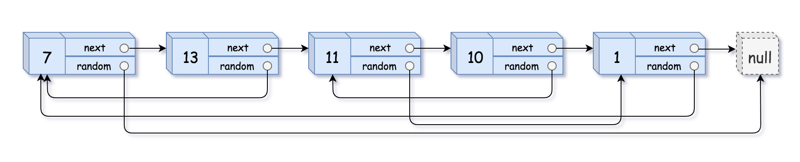
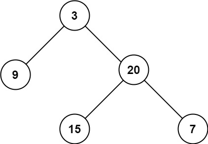
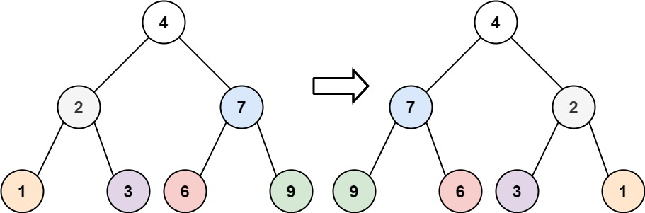
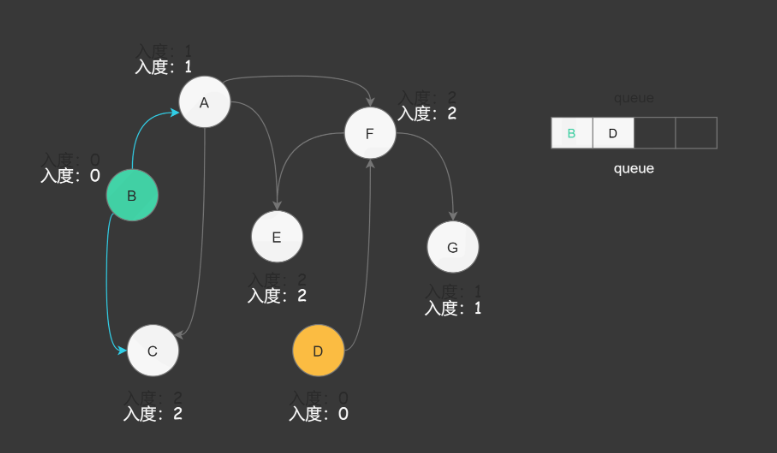
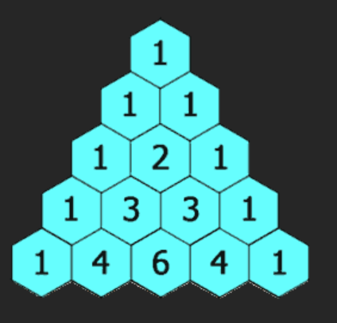

1. **Problem:** Judge a linked list be a circular one or not.

   **Solution:** Use two pointers, one fast and one slow. Move the fast pointer two steps and the slow pointer one step at a time. If they meet, the linked list is circular; if the fast pointer reaches the end, it is not circular.

   **Image example:**
   

   **Code example:**
   ```cpp
   struct ListNode {
       int val;
       ListNode *next;
       ListNode(int x) : val(x), next(NULL) {}
    };

    class Solution {
    public:
        bool hasCycle(ListNode *head) {
            if (head==nullptr or head->next==nullptr){
                return false;
            }
            ListNode *slow = head;
            ListNode *fast = head->next;
            while(fast!=slow){
                if(fast==nullptr or fast->next==nullptr){
                    return false;
                }
                slow=slow->next;
                fast=fast->next->next;
            }
            return true;
        }    
    }
   ```

   **Time complexity:** O(n), where n is the number of nodes in the linked list.

   **Points:** if a linked list is circular, the fast pointer will eventually meet the slow pointer just like a running competition. If it is not circular, the fast pointer will reach the end of the list (null) before meeting the slow pointer.

2. **Problem:** Merge two linked list into one.

   **Solution:** Use a new begin node and then traverse both linked lists, comparing the values of the current nodes. Append the smaller value to the new list and move the pointer of that list forward. Continue until one of the lists is exhausted, then append the remaining nodes from the other list.

   **Code example:**
   ```cpp
    struct ListNode {
        int val;
        ListNode *next;
        ListNode(int x) : val(x), next(NULL) {}
    };

    class Solution {
    public:
        ListNode* mergeTwoLists(ListNode* list1, ListNode* list2) {
            ListNode* dummy = new ListNode();
            ListNode* current = dummy;
            while(list1 != nullptr and list2 != nullptr){
                if(list1->val < list2->val){
                    current->next = list1;
                    list1 = list1->next;
                }
                else{
                    current->next = list2;
                    list2 = list2->next;
                }
                current = current->next;
            }
            if(list1 != nullptr){
                current->next = list1;
            }
            else{
                current->next = list2;
            }

            return dummy->next;
        }
    };
   ```

   **Time complexity:** O(n), where n is the total number of nodes in both linked lists.

   **Points:** Just traverse both linked lists once and compare their values to merge them in sorted order.

3. **Problem:** Use linked lists to store large numbers, try to add them.

   **Solution:** Traverse both linked lists simultaneously, adding corresponding digits along with any carry from the previous addition. Create a new linked list to store the result.

   **Code example:**
   ```cpp
   struct ListNode {
     int val;
     ListNode *next;
     ListNode() : val(0), next(nullptr) {}
     ListNode(int x) : val(x), next(nullptr) {}
     ListNode(int x, ListNode *next) : val(x), next(next) {}
   };

   class Solution {
    public:
        ListNode* addTwoNumbers(ListNode* l1, ListNode* l2) {
            ListNode * dummy = new ListNode();
            ListNode * current = dummy;
            int x = 0;

            while(l1 != nullptr or l2 != nullptr or x!=0){
                if(l1!=nullptr){
                    x += l1->val;
                    l1 = l1->next;
                }
                if(l2!=nullptr){
                    x += l2->val;
                    l2 = l2->next;
                }
                current->next = new ListNode(x%10);
                current = current->next;
                x /= 10;
            }
            return dummy->next;
        }
    };
   ```

   **Time complexity:** O(n), where n is the total number of nodes in both linked lists.

   **Points:** A carry is maintained during the addition process, and the result is stored in a new linked list.

4. **Problem:** Delete the last No.n node from a linked list.

   **Solution:** Use two pointers, one fast and one slow. Move the fast pointer n steps ahead, then move both pointers until the fast pointer reaches the end. The slow pointer will then point to the node to be deleted.

   **Code example:**
   ```cpp
    struct ListNode {
         int val;
         ListNode *next;
         ListNode(int x) : val(x), next(NULL) {}
     };
    
     class Solution {
     public:
          ListNode* removeNthFromEnd(ListNode* head, int n) {
                ListNode * dummy = new ListNode(0);
                dummy->next = head;
                ListNode * fast = dummy;
                ListNode * slow = dummy;
    
                for(int i=0; i<n+1; i++){
                 fast = fast->next;
                }
                while(fast!=nullptr){
                 fast = fast->next;
                 slow = slow->next;
                }
                slow->next = slow->next->next;
    
                return dummy->next;
          }
     };
   ```

   **Time complexity:** O(n), where n is the number of nodes in the linked list.

   **Points:** Let the fast pointer move n+1 steps ahead, then move both pointers until the fast pointer reaches the end. The slow pointer will then point to the node to be deleted.

5. **Problem:** Exchange nodes two by two in a linked list.

   **Solution:** Serveral times of pointers exchange, we can exchange the nodes two by two in a linked list.

   **Code example:**
   ```cpp
    struct ListNode {
         int val;
         ListNode *next;
         ListNode(int x) : val(x), next(NULL) {}
     };
    
     class Solution {
    public:
        ListNode* swapPairs(ListNode* head) {
            if (head==nullptr){
                return nullptr;
            }
            if (head->next==nullptr){
                return head;
            }

            ListNode* prev = new ListNode();
            ListNode* temp = prev;
            temp->next = head;

            while(temp->next!=nullptr and temp->next->next!=nullptr){
                ListNode* node1 = temp->next;
                ListNode* node2 = temp->next->next;
                temp->next = node2;
                node1->next = node2->next;
                node2->next = node1;
                temp = node1;
            }

            return prev->next;
        }
    };
   ```

   **Time complexity:** O(n), where n is the number of nodes in the linked list.

   **Points:** Four nodes are involved in the swapping process: the previous node, the first node to be swapped, the second node to be swapped, and the next node after the second node.

6. **Problem:** Deep copy a linked list with random pointers.

   **Solution:** Use a hash map to store the mapping between original nodes and their copies. First, create all the new nodes and store them in the hash map. Then, iterate through the original list again to set the next and random pointers of the new nodes based on the hash map.

   **Image example:**
   

   **Code example:**
   ```cpp
    struct Node {
         int val;
         Node* next;
         Node* random;
         Node(int _val) {
              val = _val;
              next = NULL;
              random = NULL;
         }
    };

    class Solution {
    public:
        Node* copyRandomList(Node* head) {
            unordered_map<Node*, Node*> hmap;

            Node*current = head;
            while(current!=nullptr){
                hmap[current] = new Node(current->val);
                current = current->next;
            }

            current = head;
            while(current!=nullptr){
                hmap[current]->next = hmap[current->next];
                hmap[current]->random = hmap[current->random];
                current = current->next;
            }

            return hmap[head];
        }
    };
   ```

   **Time complexity:** O(n), where n is the number of nodes in the linked list.

   **Points:** The key is to use a hash map to store the mapping between original nodes and their copies, and then set the next and random pointers of the new nodes based on the hash map.

7. **Problem:** Calculate the depth of a binary tree.

   **Solution:** Do a depth-first search (DFS) or breadth-first search (BFS) to traverse the tree and keep track of the maximum depth encountered.

   **Image example:**
   

   **Code example:**
   ```cpp
    struct TreeNode {
         int val;
         TreeNode *left;
         TreeNode *right;
         TreeNode(int x) : val(x), left(NULL), right(NULL) {}
     };

     class Solution {
     public:
         int maxDepth(TreeNode* root) {
             if(root==nullptr){
                 return 0;
             }
             return 1 + max(maxDepth(root->left), maxDepth(root->right));
         }
     };

     class Solution1 {
     public:
         int maxDepth(TreeNode* root) {
             if(root==nullptr){
                 return 0;
             }
             queue<TreeNode*> q;
             q.push(root);
             int depth = 0;
             while(!q.empty()){
                 int size = q.size();
                 while(size!=0){
                     TreeNode* node = q.front();
                     q.pop();
                     if(node->left!=nullptr){
                         q.push(node->left);
                     }
                     if(node->right!=nullptr){
                         q.push(node->right);
                     }
                     size--;
                 }
                 depth++;
             }
             return depth;
         }
     };
   ```

   **Time complexity:** O(n), where n is the number of nodes in the binary tree.

   **Points:** The key is to use a recursive approach to traverse the tree and keep track of the maximum depth encountered.

8. **Problem:** Invert a binary tree.

   **Solution:** Use a recursive approach to traverse the tree. For each node, swap its left and right children, then recursively invert the left and right subtrees.

   **Image example:**
   

   **Code example:**
   ```cpp
    struct TreeNode {
         int val;
         TreeNode *left;
         TreeNode *right;
         TreeNode(int x) : val(x), left(NULL), right(NULL) {}
     };

     class Solution {
     public:
         TreeNode* invertTree(TreeNode* root) {
             if(root==nullptr){
                 return nullptr;
             }
             else{
                TreeNode* left = invertTree(root->left);
                TreeNode* right = invertTree(root->right);
                root->left = right;
                root->right = left;
             }
             return root;
         }
     };
   ```

   **Time complexity:** O(n), where n is the number of nodes in the binary tree.

   **Points:** The key is to use a recursive approach to traverse the tree and swap the left and right children of each node.

9. **Problem:** Judge if a binary tree is a symmetric binary tree.

   **Solution:** Judge left->right and right->left are equal or not and left->left and right->right are equal or not. If they are equal, the binary tree is symmetric; otherwise, it is not.

   **Image example:**
   

   **Code example:**
   ```cpp
    struct TreeNode {
         int val;
         TreeNode *left;
         TreeNode *right;
         TreeNode(int x) : val(x), left(NULL), right(NULL) {}
     };

     class Solution {
     public:
         bool isSymmetric(TreeNode* root) {
             if(root==nullptr){
                 return true;
             }
             return isMirror(root->left, root->right);
         }

         bool isMirror(TreeNode* left, TreeNode* right){
             if(left==nullptr and right==nullptr){
                 return true;
             }
             if(left==nullptr or right==nullptr){
                 return false;
             }
             return (left->val==right->val) and isMirror(left->left, right->right) and isMirror(left->right, right->left);
         }
     };
   ```

   **Time complexity:** O(n), where n is the number of nodes in the binary tree.

   **Points:** The key is to use a recursive approach to traverse the tree and check if the left and right subtrees are mirrors of each other.

10. **Problem:** Make a sorted array into a balanced binary search tree.

    **Solution:** Use a recursive approach to build the tree. Select the middle element of the array as the root, and recursively build the left and right subtrees from the elements before and after the middle element.

    **Code example:**
    ```cpp
       struct TreeNode {
             int val;
             TreeNode *left;
             TreeNode *right;
             TreeNode(int x) : val(x), left(NULL), right(NULL) {}
         };

        class Solution {
        public:
            TreeNode* sortedArrayToBST(vector<int>& nums) {
                if(nums.empty()){
                    return nullptr;
                }
                return buildBST(nums, 0, nums.size()-1);
            }

        private:
            TreeNode* buildBST(vector<int>& nums, int start, int end) {
                if(start>end){
                    return nullptr;
                }
                int mid = start + (end - start) / 2;
                TreeNode* root = new TreeNode(nums[mid]);
                root->left = buildBST(nums, start, mid-1);
                root->right = buildBST(nums, mid+1, end);
                return root;
            }
        };
    ```

    **Time complexity:** O(n), where n is the number of elements in the array.

    **Points:** The key is to use a recursive approach to build the tree by selecting the middle element of the array as the root and recursively building the left and right subtrees.

11. **Problem:** Find the kth smallest element in a binary search tree.

    **Solution:** Use an in-order traversal to visit the nodes in ascending order. Keep a count of the visited nodes and return the k th node.

    **Code example:**
    ```cpp
        struct TreeNode {
             int val;
             TreeNode *left;
             TreeNode *right;
             TreeNode(int x) : val(x), left(NULL), right(NULL) {}
         };

         class Solution {
         public:
             int kthSmallest(TreeNode* root, int k) {
                 int count = 0;
                 int result = 0;
                 inorder(root, k, count, result);
                 return result;
             }

         private:
             void inorder(TreeNode* node, int k, int& count, int& result) {
                 if(node==nullptr){
                     return;
                 }
                 inorder(node->left, k, count, result);
                 count++;
                 if(count==k){
                     result = node->val;
                     return;
                 }
                 inorder(node->right, k, count, result);
             }
         };
    ```

    **Time complexity:** O(n), where n is the number of nodes in the binary tree.

    **Points:** The key is to use a recursive approach to traverse the tree and find the kth smallest element by performing an in-order traversal.

12. **Problem:** Make a binary tree into a linked list.

    **Solution:** use preorder traversal to visit the nodes in the tree and link them together in a linked list.

    **Code example:**
    ```cpp
        struct TreeNode {
             int val;
             TreeNode *left;
             TreeNode *right;
             TreeNode(int x) : val(x), left(NULL), right(NULL) {}
         };

         class Solution {
         public:
            void preorder(TreeNode*node, vector<int>& result){
                if(node==nullptr){
                    return;
                }

                result.push_back(node->val);
                preorder(node->left, result);
                preorder(node->right, result);
            }

            void flatten(TreeNode* root) {
                vector<int> result;
                preorder(root, result);
                TreeNode* current = root;
                for(int i=1; i<result.size(); i++){
                    current->left = nullptr;
                    current->right = new TreeNode(result[i]);
                    current = current->right;
                }
            }
         };
    ```

    **Time complexity:** O(n), where n is the number of nodes in the binary tree.

    **Space complexity:** O(n), where n is the number of nodes in the binary tree.

    **Points:** The key is to use a recursive approach to traverse the tree and convert it into a linked list by performing a preorder traversal.

13. **Problem:** Calculate the total number of islands in a 2D grid.

    **Solution:** Use DFS (Depth-First Search) to traverse the grid. When encountering a '1' (land), initiate a DFS to mark all connected '1's as visited, incrementing the island count.

    **Code example:**
    ```cpp
        class Solution {
        public:
            void dfs(int i, int j, vector<vector<char>>& grid) {
                grid[i][j] = '0'; // Mark the cell as visited
                int rows = grid.size();
                int columns = grid[0].size();
                if (i-1 >= 0 && grid[i-1][j] == '1') dfs(i-1, j, grid); // Up
                if (i+1 < rows && grid[i+1][j] == '1') dfs(i+1, j, grid); // Down
                if (j-1 >= 0 && grid[i][j-1] == '1') dfs(i, j-1, grid); // Left
                if (j+1 < columns && grid[i][j+1] == '1') dfs(i, j+1, grid); // Right
            }

            int numIslands(vector<vector<char>>& grid) {
                int rows = grid.size();
                int columns = grid[0].size();
                int count = 0;
                for(int i=0;i<rows;i++){
                    for(int j=0;j<columns;j++){
                        if(grid[i][j]=='1'){
                            count++;
                            dfs(i,j,grid);
                        }
                    }
                }
            }
        };
    ```

    **Time complexity:** O(m*n), where m is the number of rows and n is the number of columns in the grid.

    **Points:** The key is to use a recursive approach to traverse the grid and mark all connected '1's as visited.

14. **Problem:** Bad orange.

    **Solution:** BFS to make the bad oranges rot all the good oranges.

    **Code example:**
    ```cpp
    class Solution {
    public:
        int orangesRotting(vector<vector<int>>& grid) {
            int rows=grid.size();
            int columns=grid[0].size();
            int freecount=0;

            queue<pair<int, int>> q;

            for(int i=0;i<rows;i++){
                for(int j=0;j<columns;j++){
                    if(grid[i][j]==1){
                        freecount++;
                    }
                    else if(grid[i][j]==2){
                        q.push({i,j});
                    }
                }
            }

            int minutes=0;

            while(!q.empty()){
                if(freecount==0){
                    return minutes;
                }

                int size=q.size();
                minutes++;

                for(int i=0;i<size;i++){
                    auto [x,y] = q.front();
                    q.pop();

                    freecount -= rot(grid,x-1,y,q);
                    freecount -= rot(grid,x+1,y,q);
                    freecount -= rot(grid,x,y-1,q);
                    freecount -= rot(grid,x,y+1,q);
                }
            }

            return freecount>0 ? -1 : minutes;
        }

        int rot(vector<vector<int>>&grid,int x,int y,queue<pair<int,int>>&q){
            int rows=grid.size();
            int columns=grid[0].size();

            if(x<0 or x>=rows or y<0 or y>=columns or grid[x][y]!=1){
                return 0;
            }

            grid[x][y]=2;
            q.push({x,y});

            return 1;
        }
    };
    ```

    **Time complexity:** O(m*n), where m is the number of rows and n is the number of columns in the grid.

    **Points:** The key is to use a breadth-first search approach to simulate the rotting process, ensuring all adjacent good oranges become bad in each time step.

15. **Problem:** The table of class.

    **Solution:** The ready of each class is its indegree and only the classes with zero indegree can be taken, when a class is taken, its neighbors' indegrees are reduced, the algorithm is like BFS.

    **Image example:**
    

    **Code example:**
    ```cpp
    class Solution {
    public: 
        bool canFinish(int numCourses, vector<vector<int>>& prerequisites) {
            vector<int> indeg(numCourses, 0);
            vector<vector<int>> edge(numCourses, vector<int>());

            for(auto& p: prerequisites){
                indeg[p[0]]++;
                edge[p[1]].push_back(p[0]);
            }

            queue<int> q;
            int count = 0;

            for(int i=0;i<numCourses;i++){
                if(indeg[i]==0){
                    q.push(i);
                    count++;
                }
            }

            while(!q.empty()){
                int course = q.front();
                q.pop();

                for(int neighbor: edge[course]){
                    indeg[neighbor]--;
                    if(indeg[neighbor]==0){
                        q.push(neighbor);
                        count++;
                    }
                }
            }

            return count==numCourses;
        }
    };
    ```

    **Time complexity:** O(numCourses + prerequisites.size()).

    **Points:** The key is to use a topological sort approach to determine if all courses can be completed, ensuring no circular dependencies exist.

16. **Problem:** Binary Search.

    **Solution:** Use binary search to find the first occurrence of the target value or its insertion point in a sorted array.

    **Code example:**
    ```cpp
    class Solution {
    public:
        int searchInsert(vector<int>& nums, int target) {
            int left = 0;
            int right = nums.size() - 1;

            while(left <= right) {
                int mid = left + (right - left) / 2;
                if (nums[mid] >= target) {
                    right = mid - 1;
                } else {
                    left = mid + 1;
                }
            }
            return left;
        }
    };
    ```

    **Time complexity:** O(log n), where n is the number of elements in the sorted array.

    **Points:** The key is to use a binary search approach to efficiently find the insertion point or the target value in a sorted array.

17. **Problem:** Search the first and the last location of the target in a sorted array.

    **Solution:** Use binary search to find the first and last occurrences of the target value.

    **Code example:**
    ```cpp
    class Solution {
    public:
        vector<int> searchRange(vector<int>& nums, int target) {
            int left = 0;
            int right = nums.size() - 1;
            int first = -1;
            int last = -1;

            // Find first occurrence
            while(left <= right) {
                int mid = left + (right - left) / 2;
                if (nums[mid] > target) {
                    right = mid - 1;
                } else {
                    left = mid + 1;
                }
                if (nums[mid] == target) {
                    first = mid;
                    right = mid - 1; // Continue searching in the left half
                }
            }

            // Find last occurrence
            left = 0;
            right = nums.size() - 1;
            while(left <= right) {
                int mid = left + (right - left) / 2;
                if (nums[mid] < target) {
                    left = mid + 1;
                } else {
                    right = mid - 1;
                }
                if (nums[mid] == target) {
                    last = mid;
                    left = mid + 1; // Continue searching in the right half
                }
            }

            vector<int> result;
            result.push_back(first);
            result.push_back(last);
            return result;
        }
    };
    ```

    **Time complexity:** O(log n), where n is the number of elements in the array.

    **Points:** The key is to use binary search twice to find the first and last occurrences of the target value.

18. **Problem:** search rotating array.

    **Solution:** First fing the place where the array is rotated, then use binary search.

    **Code example:**
    ```cpp
    class Solution {
    public:
        int search(vector<int>& nums, int target) {
            if(!nums.size()){
                return -1;
            }

            if(nums.size()==1){
                return nums[0]==target ? 0 : -1;
            }
            
            int left = 1;
            int right = nums.size() - 1;
            int temptarget=nums[0];

            // Find the rotation point
            while(left <= right) {
                int mid = left + (right - left) / 2;
                if (nums[mid] <= temptarget) {
                    right = mid - 1;
                } else {
                    left = mid + 1;
                }
            }

            if (target >= temptarget) {
                left = 0;
            } 
            else {
                right = nums.size() - 1;
            }

            // Perform binary search in the appropriate half
            while(left <= right) {
                int mid = left + (right - left) / 2;
                if (nums[mid] == target) {
                    return mid;
                } 
                else if (nums[mid] < target) {
                    left = mid + 1;
                } 
                else {    
                    right = mid - 1;
                }
            }

            return -1;
        }
    };
    ```

    **Time complexity:** O(log n), where n is the number of elements in the array.

    **Points:** The key is to use binary search to efficiently find the target value in a sorted array, first finding the rotation point and then performing a standard binary search in the appropriate half, paying attention to the boundaries and the actions taken at each step.

19. **Problem:** Effective brackets.

    **Solution:** Use a stack to keep track of the opening brackets and ensure that each closing bracket matches the most recent opening bracket.

    **Code example:**
    ```cpp
    class Solution {
    public:
        bool isValid(string s) {
            stack<char> st;
            for(char c : s) {
                if(c == '(' or c == '{' or c == '[') {
                    st.push(c);
                } 
                else {
                    if(st.empty()) {
                        return false;
                    }
                    char top = st.top();
                    st.pop();
                    if(c == ')' and top != '('){
                        return false;
                    }
                    if(c == '}' and top != '{'){
                        return false;
                    }
                    if(c == ']' and top != '['){
                        return false;
                    }
                }
            }
            return st.empty() ? true : false;
        }
    };
    ```

    **Time complexity:** O(n), where n is the length of the string.

    **Points:** The key is to use a stack to match opening and closing brackets, ensuring that each closing bracket corresponds to the most recent opening bracket.

20. **Problem:** Decode the string.

    **Solution:** Use a stack to store the position of the elements and the times it will be repeated.

    **Code example:**
    ```cpp
    class Solution {
    public:
        string decodeString(string s) {
            stack<pair<int, int>> st;
            string ans;
            int count = 0;
            for(auto ch:s){
                if(isdigit(ch)){
                    count = count*10 + (ch-'0');
                }
                else if(isalpha(ch)){
                    ans += ch;
                }
                else if(ch=='['){
                    st.push({ans.size(), count});
                    count = 0;
                }
                else if(ch==']'){
                    auto [pos, times] = st.top();
                    st.pop();
                    string temp = ans.substr(pos, ans.size()-pos);
                    for(int i=0;i<times-1;i++){
                        ans += temp;
                    }
                }
            }
            return ans;
        }
    };
    ```

    **Time complexity:** O(n), where n is the length of the input string.

    **Points:** The key is to use a stack to store the position and repetition count of each opening bracket, allowing for efficient string reconstruction when closing brackets are encountered.

21. **Problem:** Daily temperatures
    
    **Solution:** Use a stack to keep track of the indices of the temperatures. For each temperature, pop from the stack until the current temperature is less than or equal to the temperature at the index stored in the stack. The difference in indices gives the number of days until a warmer temperature.

    **Code example:**
    ```cpp
    class Solution {
    public:
        vector<int> dailyTemperatures(vector<int>& temperatures) {
            int n = temperatures.size();
            vector<int> result(n, 0);
            stack<int> st; // Store indices of temperatures         

            for(int i=0; i<n; i++) {
                while(!st.empty() and temperatures[i] > temperatures[st.top()]) {
                    int prev = st.top();
                    st.pop();
                    result[prev] = i - prev;
                }
                st.push(i);
            }

            return result;
        }
    };
    ``` 
    **Time complexity:** O(n), where n is the number of temperatures.

    **Points:** The key is to use a stack to efficiently track the indices of temperatures, allowing for quick determination of the number of days until a warmer temperature is encountered.

22. **Problem:** Quick_select Problem.

    **Solution:** Use quick_sort algorithm and judge the right position of the target element k.

    **Code example:**
    ```cpp
    class Solution {
    public:
        int quick_select(vector<int>& nums, int left, int right, int k) {
            if (left == right) {
                return nums[left];
            }

            int i=left, j=right;
            int pivot = nums[left + (right - left) / 2];
            while (i <= j) {
                while (nums[i] < pivot) i++;
                while (nums[j] > pivot) j--;
                if (i <= j) {
                    swap(nums[i], nums[j]);
                    i++;
                    j--;
                }
            }

            if (k <= j) {
                return quick_select(nums, left, j, k);
            }
            if (k >= i) {
                return quick_select(nums, i, right, k);
            }

            return nums[k];
        }

        int findKthLargest(vector<int>& nums, int k) {
            int n = nums.size();
            return quick_select(nums, 0, n - 1, n - k);
        }
    };
    ```

    **Time complexity:** O(n) average, O(n^2) worst case.

    **Points:** The key is to use the quick select algorithm to efficiently find the kth largest element without fully sorting the array.

23. **Problem:** Find the most k frequent elements.

    **Solution:** Use a hash map to count the frequency of each element, then use a max-heap to keep track of the k most frequent elements.

    **Code example:**
    ```cpp
    class Solution {
    public:
        vector<int> topKFrequent(vector<int>& nums, int k) {
            unordered_map<int, int> freqMap;
            for(int num : nums) {
                freqMap[num]++;
            }

            priority_queue<pair<int, int>> maxHeap;
            for(auto& entry : freqMap) {
                maxHeap.push({entry.second, entry.first});
            }

            vector<int> result;
            for(int i = 0; i < k; i++) {
                result.push_back(maxHeap.top().second);
                maxHeap.pop();
            }

            return result;
        }
    };
    ```

    **Time complexity:** O(n log n), where n is the number of elements in the array.

    **Points:** The key is to use a hash map to count the frequency of each element and a max-heap to efficiently retrieve the k most frequent elements.

24. **Problem:** Find the best time to buy stock.

    **Solution:** Use the algorithm of greedy to find the maximum profit.

    **Code example:**
    ```cpp
    class Solution {
    public:
        int maxProfit(vector<int>& prices) {
            if(!prices.size()){
                return 0;
            }

            int minPrice = prices[0];
            int maxProfit = 0;

            for(int price : prices) {
                minPrice = min(minPrice, price);
                maxProfit = max(maxProfit, price - minPrice);
            }

            return maxProfit;
        }
    };
    ```

    **Time complexity:** O(n), where n is the number of elements in the array.

    **Points:** The key is to use a greedy approach to track the minimum price seen so far and calculate the maximum profit by comparing the current price with the minimum price.

25. **Problem:** Jump game.

    **Solution:** Use the algorithm of greedy to find the longest position it can reach.

    **Code example:**
    ```cpp
    class Solution {
    public:
        bool canJump(vector<int>& nums) {
            int maxReach = 0;
            
            for(int i = 0; i < nums.size(); i++){
                if(i <= maxReach){
                    maxReach = max(maxReach, i + nums[i]);
                    if (maxReach >= nums.size() - 1) {
                        return true;
                    }
                }
            }
           
            return false;
        }
    };
    ```

    **Time complexity:** O(n), where n is the number of elements in the array.

    **Points:** The key is to use a greedy approach to track the maximum position that can be reached, updating it as we iterate through the array, paying attention to whether the current position is reachable.

26. **Problem:** Jump game II.

    **Solution:** Use the algorithm of greedy to find the minimum number of jumps to reach the end of the array.

    **Code example:**
    ```cpp
    class Solution {
    public:
        int jump(vector<int>& nums) {
            int jumps = 0;
            int currentEnd = 0;
            int farthest = 0;

            for(int i = 0; i < nums.size() - 1; i++) {
                farthest = max(farthest, i + nums[i]);
                if(i == currentEnd) {
                    jumps++;
                    currentEnd = farthest;
                }
                if(currentEnd >= nums.size() - 1) {
                    return jumps;
                }
            }

            return jumps;
        }
    };
    ```

    **Time complexity:** O(n), where n is the number of elements in the array.

    **Points:** The key is to use a greedy approach to track the farthest position that can be reached with the current number of jumps, and increment the jump count whenever we reach the end of the current jump range.

27. **Problem:** Separate the word into different strings partitions.

    **Solution:** Use the algorithm of greedy to find the max number of partitions and its length.

    **Code example:**
    ```cpp
    class Solution {
    public:
        vector<int> partitionLabels(string s) {
            vector<int> last(26, -1);
            for(int i = 0; i < s.size(); i++) {
                last[s[i] - 'a'] = i;
            }

            vector<int> result;
            int start = 0, end = 0;
            for(int i = 0; i < s.size(); i++) {
                end = max(end, last[s[i] - 'a']);
                if(i == end) {
                    result.push_back(end - start + 1);
                    start = i + 1;
                }
            }

            return result;
        }
    };
    ```

    **Time complexity:** O(n), where n is the length of the string.

    **Points:** The key is ensure that all the preshowed characters are in the same partition and will never appear in the later partitions, so the end is updated accordingly and when the end of a partition is reached which means all characters in that partition have been considered, we add the length of that partition to the result.

28. **Problem:** Climb stairs.

    **Solution:** Use dynamic programming to calculate the number of ways to reach each step.

    **Code example:**
    ```cpp
    class Solution {
    public:
        int climbStairs(int n) {
            if(n == 1) return 1;
            if(n == 2) return 2;

            int prev2 = 1;
            int prev1 = 2;
            int current;

            for(int i = 3; i <= n; i++) {
                current = prev1 + prev2;
                prev2 = prev1;
                prev1 = current;
            }

            return current;
        }
    };
    ```

    **Time complexity:** O(n), where n is the number of steps.

    **Points:** DP[n] = DP[n-1] + DP[n-2], the number of ways to reach step n is the sum of the ways to reach step n-1 and step n-2, as you can reach step n by taking a single step from n-1 or a double step from n-2.

29. **Problem:** Yang Hui's Triangle.

    **Solution:** Use dynamic programming to generate the triangle row by row.

    **Image example:**
    

    **Code example:**
    ```cpp
    class Solution {
    public:
        vector<vector<int>> generate(int numRows) {
            vector<vector<int>> ans(numRows);

            for(int i = 0; i < numRows; i++) {
                ans[i].resize(i + 1);
                ans[i][0] = ans[i][i] = 1; // First and last elements are always 1
                for(int j = 1; j < i; j++) {
                    ans[i][j] = ans[i - 1][j - 1] + ans[i - 1][j]; // Sum of the two elements above
                }
            }

            return ans;
        }
    };
    ```

    **Time complexity:** O(n^2), where n is the number of rows.

    **Points:** The key is to use dynamic programming to build each row of the triangle based on the values of the previous row, ensuring that the first and last elements of each row are set to 1, and the inner elements are calculated as the sum of the two elements directly above them.

30. **Problem:** Rob problem.

    **Solution:** Use dynamic programming to calculate the maximum amount of money that can be robbed without alerting the police.

    **Code example:**
    ```cpp
    class Solution {
    public:
        int rob(vector<int>& nums) {
            if(nums.empty()) return 0;
            if(nums.size() == 1) return nums[0];

            int n = nums.size();
            vector<int> dp(n);
            dp[0] = nums[0];
            dp[1] = max(nums[0], nums[1]);

            for(int i = 2; i < n; i++) {
                dp[i] = max(dp[i - 1], dp[i - 2] + nums[i]);
            }

            return dp[n - 1];
        }
    };
    ```

    **Time complexity:** O(n), where n is the number of houses.

    **Points:** The key is to use dynamic programming to keep track of the maximum amount of money that can be robbed up to each house, ensuring that no two adjacent houses are robbed, dp[i] = max(dp[i-1], dp[i-2] + nums[i]).

31. **Problem:** Longest increasing subsequence.

    **Solution:** Use dynamic programming to find the length of the longest increasing subsequence in an array.

    **Code example:**
    ```cpp
    class Solution {
    public:
        int lengthOfLIS(vector<int>& nums) {
            if(nums.empty()) return 0;

            int n = nums.size();
            vector<int> dp(n, 1); // Each element is an increasing subsequence of length 1

            for(int i = 1; i < n; i++) {
                for(int j = 0; j < i; j++) {
                    if(nums[i] > nums[j]) {
                        dp[i] = max(dp[i], dp[j] + 1);
                    }
                }
            }

            return *max_element(dp.begin(), dp.end());
        }
    };
    ```

    **Time complexity:** O(n^2), where n is the number of elements in the array.

    **Points:** The key is to use dynamic programming to build up the lengths of increasing subsequences ending at each index, and then find the maximum length among them.

32. **Problem:** Perfect square number.

    **Solution:** Use dynamic programming to find the minimum number of perfect square numbers that sum to a given number.

    **Code example:**
    ```cpp
    class Solution {
    public:
        int numSquares(int n) {
            vector<int> dp(n+1, INT_MAX);
            dp[0] = 0;

            for(int i=1;i<=n;i++){
                for(int j=1;j*j<=i;j++){
                    dp[i] = min(dp[i], dp[i-j*j]+1);
                }
            }

            return dp[n];
        }
    };
    ```

    **Time complexity:** O(n * sqrt(n)), where n is the given number.

    **Points:** The key is to use dynamic programming to build up the minimum number of perfect squares needed for each number up to n, by considering all perfect squares less than or equal to the current number and updating the dp array accordingly.

33. **Problem:** Coin change.

    **Solution:** Use dynamic programming to find the minimum number of coins needed to make up a given amount.

    **Code example:**
    ```cpp
    class Solution {
    public:
        int coinChange(vector<int>& coins, int amount) {
            vector<int> dp(amount + 1, INT_MAX);
            dp[0] = 0;

            for(int i = 0; i <= amount; i++) {
                for(int coin : coins) {
                    if(coin<=i){
                        dp[i] = min(dp[i], dp[i - coin] + 1);
                    }
                }
            }

            return dp[amount] > amount ? -1 : dp[amount];
        }
    };
    ```

    **Time complexity:** O(n * m), where n is the amount and m is the number of different coins.

    **Points:** The key is to use dynamic programming to build up the minimum number of coins needed for each amount up to the target amount, by considering all coin denominations and updating the dp array accordingly.

34. **Problem:** Separate the word and judge whether it can be merged according to the dictionary.

    **Solution:** Use dynamic programming to determine if the string can be segmented into a satisfied string and a word in the dictionary.

    **Code example:**
    ```cpp
    class Solution {
    public: 
        bool wordBreak(string s, vector<string>& wordDict) {
            unordered_set<string> dict(wordDict.begin(), wordDict.end());

            int n = s.size();
            vector<bool> dp(n + 1, false);
            dp[0] = true; // Empty string can be segmented

            for(int i = 0; i <= n; i++) {
                for(int j = 0; j < i; j++) {
                    if(dp[j] and dict.find(s.substr(j, i - j)) != dict.end()) {
                        dp[i] = true;
                        break;
                    }
                }
            }

            return dp[n];
        }
    };
    ```

    **Time complexity:** O(n^2), where n is the length of the string.

    **Points:** The key is to use dynamic programming to determine if the string can be segmented into a sequence of words from the dictionary, ensuring that each substring is a valid word in the dictionary.

35. **Problem:** Longest increasing subsequence.

    **Solution:** Use dynamic programming to find the length of the longest increasing subsequence in an array.

    **Code example:**
    ```cpp
    class Solution {
    public:
        int lengthOfLIS(vector<int>& nums) {
            if(nums.empty()) return 0;

            int n = nums.size();
            vector<int> dp(n, 1);

            for(int i = 1; i < n; i++) {
                for(int j = 0; j < i; j++) {
                    if(nums[i] > nums[j]) {
                        dp[i] = max(dp[i], dp[j] + 1);
                    }
                }
            }

            return *max_element(dp.begin(), dp.end());
        }
    };
    ```

    **Time complexity:** O(n^2), where n is the number of elements in the array.

    **Points:** The key is to use dynamic programming to build up the lengths of increasing subsequences ending at each index, and then find the maximum length among them.

36. **Problem:** Max product subarray.

    **Solution:** Use dynamic programming to find the maximum product of a contiguous subarray.

    **Code example:**
    ```cpp
    class Solution {
    public:
        int maxProduct(vector<int>& nums) {
            if(!nums.size()){ 
                return 0;
            }

            int n = nums.size();
            vector<long long> maxProd(n,nums[0]), minProd(n,nums[0]);

            for(int i=1;i<n;i++){
                long long x = nums[i];
                maxProd[i] = max({x, x*maxProd[i-1], x*minProd[i-1]});
                minProd[i] = min({x, x*maxProd[i-1], x*minProd[i-1]});
            }

            return *max_element(maxProd.begin(), maxProd.end());
        }
    };
    ```

    **Time complexity:** O(n), where n is the number of elements in the array.

    **Points:** The key is to use dynamic programming to keep track of both the maximum and minimum products at each index, as a negative number can turn a small product into a large one and vice versa.

37. **Problem:** Partition equal subset sum.

    **Solution:** Use dynamic programming to determine if the array can be partitioned into two subsets with equal sum.

    **Code example:**
    ```cpp
    class Solution {
    public:
        bool canPartition(vector<int>& nums) {
            int n=nums.size();
            if(n < 2){
                return false;
            }

            int sum=accumulate(nums.begin(), nums.end(), 0);
            if(sum % 2 != 0){
                return false;
            }

            int max_num=*max_element(nums.begin(), nums.end());
            int target=sum/2;
            if(max_num > target){
                return false;
            }

            vector<vector<bool>> dp(n, vector<bool>(target + 1, false));

            for(int i=0;i<n;i++){
                dp[i][0]=true;
            }

            dp[0][nums[0]]=true;

            for(int i=1;i<n;i++){
                int num=nums[i];
                for(int j=1;j<=target;j++){
                    if(j >= num){
                        dp[i][j]=dp[i-1][j] or dp[i-1][j-num];
                    }
                    else{
                        dp[i][j]=dp[i-1][j];
                    }
                }
            }

            return dp[n-1][target];
        }
    };
    ```

    **Time complexity:** O(n * target), where n is the number of elements in the array and target is half of the total sum.

    **Points:** The key is to use dynamic programming to determine if a subset of the array can sum up to half of the total sum, effectively checking if the array can be partitioned into two equal subsets.

38. **Problem:** Unique paths.

    **Solution:** Use dynamic programming to calculate the number of unique paths from the top-left corner to the bottom-right corner of a grid.

    **Code example:**
    ```cpp
    class Solution {
    public:
        int uniquePaths(int m, int n) {
            vector<vector<int>> dp(m, vector<int>(n, 1));

            for(int i = 1; i < m; i++) {
                for(int j = 1; j < n; j++) {
                    dp[i][j] = dp[i - 1][j] + dp[i][j - 1];
                }
            }

            return dp[m - 1][n - 1];
        }
    };
    ```

    **Time complexity:** O(m * n), where m is the number of rows and n is the number of columns in the grid.

    **Points:** The key is to use dynamic programming to build up the number of unique paths to each cell in the grid based on the paths to the cells directly above and to the left.

39. **Problem:** Minimum path sum.
    
    **Solution:** Use dynamic programming to calculate the minimum path sum from the top-left corner to the bottom-right corner of a grid.

    **Code example:**
    ```cpp
    class Solution {
    public:
        int minPathSum(vector<vector<int>>& grid) {
            int m = grid.size();
            int n = grid[0].size();

            vector<vector<int>> dp(m, vector<int>(n, 0));
            dp[0][0] = grid[0][0];

            for(int i = 1; i < m; i++) {
                dp[i][0] = dp[i - 1][0] + grid[i][0];
            }
            for(int j = 1; j < n; j++) {
                dp[0][j] = dp[0][j - 1] + grid[0][j];
            }

            for(int i = 1; i < m; i++) {
                for(int j = 1; j < n; j++) {
                    dp[i][j] = min(dp[i - 1][j], dp[i][j - 1]) + grid[i][j];
                }
            }

            return dp[m - 1][n - 1];
        }
    };
    ```

    **Time complexity:** O(m * n), where m is the number of rows and n is the number of columns in the grid.

    **Points:** The key is to use dynamic programming to build up the minimum path sum to each cell in the grid based on the minimum sums to the cells directly above and to the left, the minimum num is determined by the up or left cell.

40. **Problem:** Longest palindromic substring.

    **Solution:** Use dynamic programming to find the longest palindromic substring in a given string.

    **Code example:**
    ```cpp
    class Solution {
    public:
        string longestPalindrome(string s) {
            int n = s.size();
            if(n == 0) return "";

            vector<vector<bool>> dp(n, vector<bool>(n, false));
            int start = 0, maxLen = 1;

            for(int i = 0; i < n; i++) {
                dp[i][i] = true;
            }

            for(int i=n-1; i>=0; i--) {
                for(int j=i+1; j<n; j++) {
                    if(s[i] == s[j] and (j - i <= 2 or dp[i + 1][j - 1])) {
                        dp[i][j] = true;
                        if(j - i + 1 > maxLen) {
                            start = i;
                            maxLen = j - i + 1;
                        }
                    }
                }
            }

            return s.substr(start, maxLen);
        }
    };
    ```

    **Time complexity:** O(n^2), where n is the length of the string.

    **Points:** The key is to use dynamic programming to build up a table that tracks whether substrings are palindromes, updating the longest palindromic substring found as we iterate through the string, ensuring that we check both the characters at the ends and the status of the substring in between.

41. **Problem:** Longest common substring.

    **Solution:** Use dynamic programming to calculate the length of the longest common substring between two strings.

    **Code example:**
    ```cpp
    class Solution {
    public:
        int longestCommonSubstring(string s1, string s2) {
            int m = s1.size();
            int n = s2.size();
            vector<vector<int>> dp(m + 1, vector<int>(n + 1, 0));
            
            for(int i = 1; i <= m; i++) {
                char c1 = s1[i - 1];
                for(int j = 1; j <= n; j++) {
                    char c2 = s2[j - 1];
                    if(c1 == c2) {
                        dp[i][j] = dp[i - 1][j - 1] + 1;
                    }
                    else {
                        dp[i][j] = max(dp[i - 1][j], dp[i][j - 1]);
                    }
                }
            }

            return dp[m][n];
        }
    };
    ```

    **Time complexity:** O(m * n), where m is the number of rows and n is the number of columns in the grid.

    **Points:** The key is to use dynamic programming to build up the length of the longest common substring at each position in the grid, ensuring that we only consider substrings that are common to both strings, dp[i][j] represents the length of the common substring ending at positions i-1 and j-1 in s1 and s2 respectively, if s1[i-1] == s2[j-1] then dp[i][j] = dp[i-1][j-1] + 1, while if they are not equal, we take the maximum of the previous values dp[i-1][j] and dp[i][j-1].

42. **Problem:** Edit distance.

    **Solution:** Use dynamic programming to calculate the minimum number of operations required to convert one string into another.

    **Code example:**
    ```cpp
    class Solution {
    public:
        int minDistance(string word1, string word2) {
            int m = word1.size();
            int n = word2.size();
            vector<vector<int>> dp(m + 1, vector<int>(n + 1, 0));

            if(m*n == 0) {
                return m + n;
            }
            
            for(int i = 1; i <= m; i++) {
                dp[i][0] = i;
            }
            for(int j = 1; j <= n; j++) {
                dp[0][j] = j;
            }

            
            for(int i=1;i<=m;i++){
                for(int j=1;j<=n;j++){
                    if(word1[i-1]==word2[j-1]){
                            dp[i][j]=min(dp[i-1][j-1], min(dp[i-1][j]+1, dp[i][j-1]+1));
                        }
                    else{
                        dp[i][j]=min(dp[i-1][j-1]+1, min(dp[i][j-1]+1,dp[i-1][j]+1));
                    }
                }
            }

            return dp[m][n];
        }
    };
    ```

    **Time complexity:** O(m * n), where m is the length of the first string and n is the length of the second string.

    **Points:** The key is to use dynamic programming to build up the minimum edit distance at each position in the grid, ensuring that we only consider the operations needed to transform one string into another. The value at dp[i][j] represents the minimum number of operations required to convert the first i characters of word1 into the first j characters of word2. If the characters match, we take the value from dp[i-1][j-1]; if they do not match, we take the minimum value from either dp[i-1][j]+1 (deletion), dp[i][j-1]+1 (insertion), or dp[i-1][j-1]+1 (substitution).

43. **Problem:** Next permutation.

    **Solution:** Find the first element from the right that is smaller than its next element, then swap it with the smallest element to its right that is larger than it, and finally reverse the elements to its right.

    **Code example:**
    ```cpp
    class Solution {
    public:
        void nextPermutation(vector<int>& nums) {
            int n = nums.size();

            int i = n - 2;
            while(i >= 0 && nums[i] >= nums[i + 1]) {
                i--;
            }

            if(i >= 0) {
                int j = n - 1;
                while(nums[j] <= nums[i]) {
                    j--;
                }
                swap(nums[i], nums[j]);
            }

            reverse(nums.begin() + i + 1, nums.end());
        }
    };
    ```

    **Time complexity:** O(n), where n is the number of elements in the array.

    **Points:** After putting the smaller one element in place, we reverse the elements to its right to get the next permutation in lexicographical order.

44. **Problem:** Trapping rain water.

    **Solution:** Use two pointers to calculate the trapped water by keeping track of the maximum heights from both ends.

    **Code example:**
    ```cpp
    class Solution {
    public:
        int trap(vector<int>& height) {
            int ans = 0;
            int left = 0, right = height.size() - 1;
            int leftMax = 0, rightMax = 0;

            while(left < right) {
                leftMax = max(leftMax, height[left]);
                rightMax = max(rightMax, height[right]);

                if(leftMax < rightMax) {
                    ans += leftMax - height[left];
                    left++;
                } 
                else {
                    ans += rightMax - height[right];
                    right--;
                }
            }

            return ans;
        }
    };
    ```

    **Time complexity:** O(n), where n is the number of elements in the array.

    **Points:** The key is to use two pointers to traverse the array from both ends, keeping track of the maximum heights encountered so far and calculating the trapped water based on the difference between the current height and the maximum height.

45. **Problem:** Longest substring without repeating characters.

    **Solution:** Use a sliding window approach with a hash map to keep track of the characters and their indices.

    **Code example:**
    ```cpp
    class Solution {
    public:
        int lengthOfLongestSubstring(string s) {
            unordered_set<char> charSet;
            int left = 0, maxLength = 0;
            int n = s.size();

            for(int right = 0; right < n; right++) {
                while(charSet.find(s[right]) != charSet.end()) {
                    charSet.erase(s[left]);
                    left++;
                }
                charSet.insert(s[right]);
                maxLength = max(maxLength, right - left + 1);
            }

            return maxLength;
        }
    };
    ```

    **Time complexity:** O(n), where n is the length of the string.

    **Points:** The key is to use a sliding window approach with a hash set to keep track of the characters in the current substring, expanding the window by moving the right pointer and contracting it by moving the left pointer when a duplicate character is found, if you find that the current character is already in the set, you should move the left pointer to remove it until it's no longer in the set because it must be a substring of the original string.

